# Documentação IoTDoc - Módulo 4 - Inteli

## Heimdall

### Integrantes do grupo

#### Felipe Sabino Spina

#### João Pedro Brandão de Moura

#### João Pedro Rodrigues Sotto Maior

#### Joselito Júnior Motta de Carvalho

#### Lucas de Luccas

#### Luigi Otávio Macedo

## Sumário

[1. Introdução](#c1)

[2. Metodologia](#c2)

[3. Desenvolvimento e Resultados](#c3)

[4. Possibilidades de Descarte](#c4)

[5. Conclusões e Recomendações](#c5)

[6. Referências](#c6)

 

# 1. Introdução

&emsp;&emsp;O projeto consiste no desenvolvimento de uma solução baseada na IoT (Internet of Things - Internet das Coisas). A Internet das Coisas é caracterizada pela interconexão de objetos cotidianos com a internet, criando uma rede de objetos físicos capazes de coletar, processar e transmitir dados. Em parceria com o renomado Hospital Alma Sírio-Libanês, fundado em 15 de agosto de 1965, nosso objetivo é alinhar a inovação tecnológica com a excelência em saúde e sustentabilidade.

&emsp;&emsp;Este projeto é parte integrante do compromisso do Alma Sírio-Libanês em oferecer serviços de saúde de alta qualidade, impulsionados pela inovação e pela tecnologia". Por meio da IoT, estamos trabalhando para aprimorar a experiência dos pacientes e a eficiência operacional do hospital, tornando a jornada de cuidados de saúde mais eficaz e orientada pela tecnologia. Assim, nossa parceria visa criar um ambiente hospitalar mais inteligente e conectado, onde a tecnologia desempenha um papel fundamental na melhoria dos cuidados de saúde e na otimização dos processos de atendimento.

## 1.1 Objetivos

&emsp;&emsp;Desenvolver uma Solução IoT Eficiente: Um dos principais objetivos deste projeto é criar uma solução baseada na Internet das Coisas (IoT) que seja altamente eficaz e integrada ao ambiente hospitalar. Esta solução IoT visa aprimorar significativamente a gestão operacional e a experiência dos pacientes, aproveitando a tecnologia de forma inovadora.

&emsp;&emsp;Facilitar a Tomada de Decisão dos Médicos em Serviços de Emergência: Buscamos simplificar e agilizar a tomada de decisões dos médicos em serviços de emergência. Nossa solução IoT permitirá que os médicos identifiquem rapidamente pacientes e determinem o curso de ação mais apropriado, economizando preciosos minutos em situações críticas.

&emsp;&emsp;Facilitar a Alocação de Recursos e Salas em Serviços de Emergência: Além disso, nosso projeto se concentra em otimizar a alocação de recursos, incluindo a designação de salas e equipamentos em serviços de emergência. Isso garantirá que cada paciente receba o atendimento necessário no local adequado, melhorando a eficiência e a qualidade dos cuidados de saúde.

&emsp;&emsp;Desenvolver uma Interface Amigável para Profissionais de Saúde: Reconhecendo a importância dos enfermeiros e médicos no processo de atendimento, nossa solução incluirá uma interface intuitiva e de fácil utilização. Isso permitirá que os profissionais de saúde interajam de forma eficaz com o software, garantindo uma transição suave para as novas tecnologias e melhorando a eficiência no local de trabalho.

## 1.2 Proposta da solução

&emsp;&emsp;Nossa solução consiste no desenvolvimento de uma aplicação web em conjunto com um dispositivo IOT para resolver o problema da má gestão de tempo e fluxo de atendimentos. Com o dispositivo IOT integrado com a plataforma web, somos capazes de rastrear a localização dos pacientes do pronto socorro do hospital Sírio Libanês, a fim de alocar as equipes médicas de acordo com as demandas do PA, mitigando riscos e evitando gargalos.

&emsp;&emsp;Nesse contexto, concentramos nossos esforços na criação de uma solução que aprimore a localização, escolha e redirecionamento de médicos e pacientes dentro do departamento de emergência durante o horário de atendimento. O nosso projeto visa otimizar o fluxo de atendimento, garantindo que cada paciente seja direcionado de forma eficaz e que as equipes médicas possam responder prontamente às situações de emergência.

## 1.3 Justificativa

&emsp;&emsp;Nossa solução combina dispositivos IoT e uma plataforma web para otimizar o atendimento no Pronto Atendimento do Hospital Sírio Libanês. Ela oferece benefícios como a alocação eficiente de equipes médicas, mitigação de riscos e melhoria na experiência do paciente, através de tecnologias que rastream o paciente dentro das dependências do hospital. Além disso, diferencia-se por seu compromisso com a inovação e eficiência operacional, contribuindo para um atendimento de excelência.

# 2. Metodologia

&emsp;&emsp;No desenvolvimento do nosso projeto  utilizando IoT no Hospital Sírio-Libanês, adotamos a metodologia RM-ODP (Reference Model for Open Distributed Processing) como nosso principal guia estrutural e conceitual. Essa escolha metodológica é motivada pela complexidade e pelo caráter inovador do projeto, que requer uma abordagem sistêmica e multidimensional para garantir seu sucesso.

&emsp;&emsp;O RM-ODP é um modelo de referência reconhecido internacionalmente, desenvolvido para facilitar a construção de sistemas abertos e distribuídos. Ele se destaca por oferecer uma estrutura composta de cinco visões arquiteturais distintas, cada uma abordando diferentes aspectos de um sistema: Negócios, Funcionais, Não Funcionais, Arquitetura e Tecnologia. Essa abordagem (mostrada na imagem 00) é ideal para nosso projeto, pois permite uma análise detalhada e uma implementação eficaz em um ambiente tão dinâmico e exigente quanto o hospitalar.

Imagem 01 - Metodologia RM-ODP

  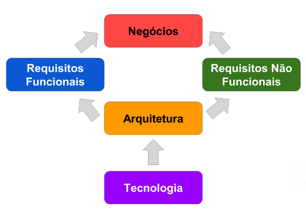
    
Fonte: Victor Hayashi

&emsp;&emsp;A aplicação da metodologia RM-ODP neste projeto visa não apenas atender aos requisitos técnicos e operacionais do sistema de geoposicionamento e IoT, mas também alinhar a solução com os objetivos estratégicos do Hospital Sírio-Libanês. Buscamos, portanto, uma implementação que não apenas melhore a eficiência operacional, mas também enriqueça a experiência do paciente e da equipe médica, respeitando as normativas de segurança e privacidade de dados.

&emsp;&emsp;Nessa seção, detalhamos cada uma das cinco visões da RM-ODP, descrevendo como elas se aplicam ao contexto do nosso projeto e delineando o caminho que seguimos desde a concepção até a implementação da solução proposta.

### Ponto de Vista da Informação (Negócio)

&emsp;&emsp;Esse aspecto trata da modelagem e manipulação dos dados de trabalho. No contexto do nosso projeto, ele foca em como os dados dos pacientes e da equipe são coletados, processados e utilizados para melhorar a eficiência dos serviços de pronto-atendimento. Assim, na visão de negócios, nosso foco é entender profundamente o contexto do Hospital Sírio-Libanês e as necessidades específicas associadas ao acompanhamento de tempos e movimentos. Nesta etapa, identificamos os objetivos estratégicos do hospital, tais como otimização de fluxos, melhoramento da qualidade do atendimento e aumento da eficiência operacional. Também levamos em consideração a dinâmica do ambiente hospitalar, as expectativas das partes interessadas e a importância de integrar novas tecnologias de forma que complementem e melhorem os processos existentes.

### Ponto de Vista da Computação 

&emsp;&emsp;No ponto de vista computação, o foco é a distribuição e relação entre os sistemas distribuídos. Especificamos como as operações funcionam e como os componentes do nosso sistema IoT interagem entre si para processar e transmitir dados. A interoperabilidade entre dispositivos de monitoramento de pacientes, sensores RFID e a plataforma central é crucial para a eficácia do sistema. Alinhado a isso, os Requisitos Funcionais da nossa solução são projetados para abordar as necessidades específicas identificadas na Visão de Negócios. Nessa fase, definimos como a tecnologia IoT e o geoposicionamento serão utilizados para monitorar o movimento de pacientes e funcionários dentro do hospital. Isso inclui a capacidade de rastrear em tempo real, emitir alertas e fornecer dados precisos para tomada de decisões. Consideramos também a integração com sistemas hospitalares existentes para garantir uma boa implementação.

### Ponto de Vista de Engenharia

&emsp;&emsp;Esse ponto é responsável por detalhar a organização e arquitetura do software e da solução em termos de componentes físicos, módulos, interfaces e interações. No nosso projeto, isso inclui a disposição dos sensores RFID, a configuração dos microcontroladores e a integração com a rede do hospital, proporcionando uma visão abrangente de como o sistema é construído e operado. Relacionado a isso, na fase de Arquitetura, delimitamos a estrutura geral do nosso sistema de geoposicionamento e IoT. Isso envolve a definição da arquitetura de rede, seleção de dispositivos IoT, como sensores e tags RFID, e a estruturação da plataforma de dados. A arquitetura é projetada para ser robusta e flexível, permitindo ajustes e expansões conforme necessário.

### Interação e Tecnologia

&emsp;&emsp;A interação aborda a comunicação entre dispositivos distribuídos, incluindo protocolos de comunicação, padrões de interação e identificação, e alertas de eventos relevantes. Isso é particularmente importante em nosso projeto para garantir que a comunicação entre os sensores RFID, os microcontroladores e a plataforma central seja eficiente, confiável e em tempo real. Assim, aqui entra também a visão da tecnologia, a qual foca na seleção de hardware e software apropriados para a solução. Avaliamos diversas tecnologias de geoposicionamento e IoT, e assim, selecionamos aquelas que oferecem a melhor performance, integração e custo-benefício para o ambiente hospitalar. Além disso, também consideramos aspectos como a facilidade de uso dos dispositivos pelos funcionários do hospital e pacientes, bem como a integração com tecnologias móveis e plataformas de análise de dados.

### Política

&emsp;&emsp;Esse ponto trata dos conceitos legais, éticos e morais da solução, incluindo questões de segurança, política de dados, governança de dados, controle de acesso e gerenciamento de recursos. No nosso projeto, isso se traduz em garantir a conformidade com as leis de privacidade de dados, como a LGPD, e as políticas internas do hospital relacionadas à segurança e privacidade dos dados dos pacientes. Assim é possível relacionar isso com a visão dos Requisitos Não Funcionais, os quais se concentram em assegurar a confiabilidade, segurança, privacidade e escalabilidade do nosso sistema. Isso inclui a conformidade com a LGPD (Lei Geral de Proteção de Dados), garantindo que todos os dados dos pacientes e funcionários sejam tratados com o mais alto nível de segurança e privacidade. A escalabilidade é crucial para o sistema poder se adaptar a mudanças nas demandas e no ambiente hospitalar.

&emsp;&emsp;Tendo isso em vista, o método RM-ODP nos fornece uma estrutura abrangente e sistematizada para o desenvolvimento do projeto. O que nos garante que todas as dimensões importantes sejam contempladas; desde os objetivos estratégicos do hospital, até a seleção das tecnologias mais adequadas para a implementação da solução.

# 3. Desenvolvimento e Resultados

## 3.1. Domínio de Fundamentos de Negócio

### 3.1.1. Contexto da Indústria

&emsp;&emsp;A análise do ambiente competitivo é essencial para compreender o posicionamento do Hospital Sírio-Libanês no setor de saúde de alto padrão. Utilizaremos o modelo das 5 Forças de Porter, uma estrutura analítica desenvolvida por Michael Porter, para examinar as dinâmicas competitivas que moldam o cenário em que o hospital opera. Antes de prosseguirmos, é útil visualizar as cinco forças que compõem essa análise. A imagem abaixo ilustra as forças que influenciam a competitividade no setor de saúde.

  
Tabela 01 - 5 Forças de Porter

   

| Força | Quem são? | Quais ameaças? | Quais as reações possíveis? |
|-------|-----------|----------------|-----------------------------|
| **CONCORRENTES ATUAIS** | Hospital Albert Einstein, Hospital Samaritano, Hospital Alemão Oswaldo Cruz. | Perda de clientes (pacientes), perda de rentabilidade, perda de insfraestrutura tecnológica e perda de valor de mercado | Ampliar a insfraestrutura tecnológica, buscar por profissionais qualificados no mercado e investir em parcerias que possam beneficiar o hospital.  |
| **CONCORRENTES POTENCIAIS** | Hospitais com localizações centralizadas como o Sírio, hospitais com grande investimento tecnológico na rede de equipamentos, hospitais que pagam mais seus médicos, induzindo os melhores a trabalharem por eles. | O serviço, equipamentos e infraestrutura dos concorrentes chamarem mais atenção do público. A localização, em muitos casos, torna-se o fator principal de escolha na hora de uma emergência. | Buscar constante inovação no setor tecnológico, analisar os concorrentes em busca de uma referência sobre a infraestrutura e serviços oferecidos e ampliar sua rede de hospitais. |
| **PRODUTOS SUBSTITUTOS**| Telemedicina, automedicação, medicina domiciliar (na própria casa), medicina integrativa e reabilitação. | A substituição, por parte dos pacientes, da maneira como preferem ser atendidos. Fazendo com que deixem de frequentar o hospital presencialmente, ou até mesmo em ambos serviços. | Incentivar o uso do hospital enfatizando a tecnologia presencial. Entretanto, manter clientes que usam a telemedicina engajados com o serviço, melhorando cada vez os atendimentos onlines. |
| **FORNECEDORES** | Fornecedores de equipamentos tecnológicos especializados para medicina, como a health tech. Fornecedores de segurança do sistema, a fim de manter os dados de cada paciente seguros e privados, fornecedores de medicações e produtos químicos que são utilizados em operações médicas.  | Inflação nos preços dos equipamentos, medicações e outros produtos, intervenção política por parte do estado e quebra das empresas fornecedoras, impedindo a requisição desses serviços. | Estudo detalhado e análise estatística do financeiro da empresa a fim de evitar investimentos que não traram retornos positivos. Analisar todos os fornecedores em potêncial e otimizar e filtrar gastos mensais e anuais. |
| **CLIENTES** | Pacientes particulares com alto poder aquisitivo, planos de sáude, clientes redirecionados por outros hospitais/médicos, convênios empresariais e clientes imigrantes.| Escolha por outros hospitais do mesmo padrão de infraestrutura e tecnológica, por parte dos pacientes. Outros hospitais que possam atender mais as expectativas dos pacientes que bscam por serviços nesse padrão de atendimento e infraestrutura. | Atender mais planos de sáude, contratar médicos qualificados médicos para atender pacientes que falam outras línguas, buscar inovação tecnológica constantemente e analisar o serviço concorrente buscando sempre estar preparado para alterações no atendimento . |

 
    
Fonte: elaborada pelo grupo

&emsp;&emsp;No contexto desta análise, identificaremos os principais concorrentes, o modelo de negócio do Sírio-Libanês e as tendências que atualmente afetam a indústria da saúde. Essas informações fornecerão uma visão abrangente do ambiente competitivo em que o hospital está inserido e servirão como base para estratégias futuras de crescimento e diferenciação.

&emsp;&emsp;O Hospital Sírio-Libanês enfrenta uma concorrência significativa de três principais competidores: Hospital Albert Einstein, Hospital Beneficência Portuguesa e Hospital Samaritano. O Hospital Albert Einstein é amplamente reconhecido por sua excelência em tratamentos de alta complexidade e pesquisas médicas inovadoras. A Beneficência Portuguesa é conhecida por oferecer uma gama abrangente de especialidades médicas e uma reputação sólida na comunidade médica. O Hospital Samaritano, por sua vez, se destaca pela qualidade dos serviços e pela atenção personalizada aos pacientes.

&emsp;&emsp;Em termos de modelo de negócio, o Hospital Sírio-Libanês opera com foco na prestação de serviços de saúde de alta qualidade. Além dos serviços clínicos e cirúrgicos, o hospital oferece uma ampla gama de serviços complementares, como exames de diagnóstico avançados e tratamentos especializados. O investimento em tecnologia e a ênfase na inovação médica são partes integrais do modelo de negócio, garantindo tratamentos de última geração aos pacientes.

&emsp;&emsp; Por outro lado, tendências recentes na indústria da saúde apontam para uma maior integração de tecnologia na prestação de cuidados médicos. A telemedicina, a aplicação de inteligência artificial no diagnóstico e tratamento, e a crescente demanda por serviços personalizados são fatores determinantes no cenário competitivo. Além disso, a ênfase crescente na medicina preventiva e na saúde digital representa uma oportunidade de crescimento e diferenciação para o Hospital Sírio-Libanês, proporcionando um ambiente propício para a inovação e aprimoramento contínuo dos serviços oferecidos.

### 3.1.2. Análise SWOT

&emsp;&emsp;A matriz SWOT, uma sigla em inglês que representa Strengths (Forças), Weaknesses (Fraquezas), Opportunities (Oportunidades) e Threats (Ameaças), é uma ferramenta amplamente utilizada no âmbito empresarial para análise estratégica. Ela proporciona uma visão abrangente do ambiente interno e externo de uma organização. As forças e fraquezas referem-se aos elementos internos, como habilidades, recursos e deficiências, que influenciam diretamente a performance da empresa. Por outro lado, as oportunidades e ameaças concentram-se nos fatores externos, como tendências de mercado, concorrência e regulamentações, que podem impactar o negócio.

&emsp;&emsp;Ao identificar e avaliar esses quatro aspectos, a matriz SWOT capacita as empresas a desenvolverem estratégias mais informadas e adaptáveis, ajudando-as a capitalizar em suas vantagens competitivas e mitigar possíveis desafios.

&emsp;&emsp;Com isso em vista, a partir da figura 1, foi elaborada uma análise SWOT sobre o Sírio-Libanês:

  
Imagem 02 - Análise SWOT

  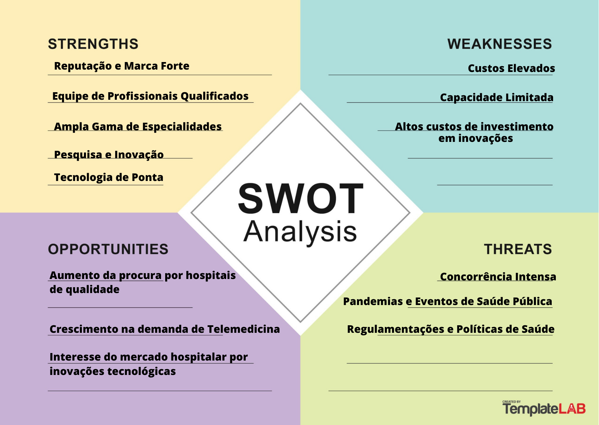
  
Fonte: elaborada pelo grupo

**Forças (Strengths):**

1. **Reputação e Marca Forte**: O Sírio-Libanês é um dos hospitais mais renomados do Brasil, o que atrai pacientes de todo o país e mesmo internacionalmente.

2. **Equipe de Profissionais Qualificados**: O hospital é conhecido por contar com especialistas de renome em várias áreas, garantindo tratamentos e diagnósticos de alta qualidade.

3. **Ampla Gama de Especialidades**: Oferece tratamentos em diversas áreas da medicina, o que o torna um centro de referência para várias especialidades.

4. **Pesquisa e Inovação**: O hospital investe em pesquisas médicas, colaborando com avanços na área da saúde e tratamentos inovadores.

5. **Tecnologia de Ponta**: Modernas instalações e equipamentos de última geração asseguram a precisão nos diagnósticos e tratamentos.

**Fraquezas (Weaknesses):**

1. **Custos Elevados**: Os tratamentos no Sírio-Libanês podem ter um custo elevado, o que pode ser uma barreira para algumas pessoas.

2. **Capacidade Limitada**: Devido à alta demanda e prestígio, pode haver tempos de espera para determinados tratamentos ou consultas. Um dos pontos do projeto é melhorar esse tempo.

3. **Altos custos de investimento em inovações**: Devido a característica do Sírio Libanês de sempre inovar na frente de tecnologia, é necessário um grande investimento nesses fundos, o que gera possíveis riscos.

**Oportunidades (Opportunities):**

1. **Aumento da procura por hospitais de qualidade**: A procura por hospitais de renome aumentou nos últimos anos após o surto de saúde pública que afetou o mundo todo.

2. **Crescimento na demanda de telemedicina**: Nos últimos anos a telemedicina tem se tornado um diferencial que tem atraido mais clientes pela eficiência e conforto.

3. **Interesse do mercado hospitalar por inovações tecnológicas**: Levando em consideração o Interesse do mercado por novas tecnologias, o Sírio Libanês pode se tornar um centro de inovações para diversas empresas.

**Ameaças (Threats):**

1. **Concorrência Intensa**: Há outros hospitais e clínicas de alta qualidade no Brasil, o que significa concorrência no setor de saúde de alta gama, como o Albert Einstein.

2. **Pandemias e Eventos de Saúde Pública**: Eventos como a COVID-19 podem sobrecarregar o sistema, exigindo adaptações rápidas.

3. **Regulamentações e Políticas de Saúde**: Mudanças na legislação ou nas políticas de saúde pública podem impactar o modo como o hospital opera e atende seus pacientes.

### 3.1.3. Descrição da Solução a ser Desenvolvida

&emsp;&emsp;A solução se dá por um dispositivo IoT integrado a um sistema web. Com o dispositivo, podemos rastrear os pacientes que chegam no pronto socorro, a fim de ter mais informações sobre o fluxo de pacientes nos processos de triagem, exames, consultas, entre outros. Dessa forma, podemos notificar as equipes médicas para evitar gargalos e tempos de espera inadequados para cada situação.

#### 3.1.3.1 Qual é o problema a ser resolvido

&emsp;&emsp;O hospital atualmente possui o problema de má gestão do fluxo dos pacientes dentro do PA (Pronto Atendimento). Essa má gestão causa tempo e atendimentos não otimizados, onde as equipes médicas não tem controle sobre os pacientes que circulam nos processos do PA. Tudo isso se resume em maiores riscos e uma pior experiência do paciente no hospital.

#### 3.1.3.2 Qual a solução proposta (visão de negócios)

&emsp;&emsp;A solução permite uma melhor alocação dos recursos humanos, ou seja, médicos e enfermeiros, de acordo com a demanda do pronto socorro. Isso resulta em um fluxo de atendimento mais eficiente, sem altos tempos de espera e pacientes desamparados.

#### 3.1.3.3 Como a solução proposta deverá ser utilizada

&emsp;&emsp;O dispositivo Iot desenvolvido deve ser acoplado aos pacientes que chegam no Pronto Atendimento do hospital. O dispositivo vai rastrear sua localização e identificar o tempo gasto em cada setor do PA. Essas informações são enviadas ao sistema, e caso haja pacientes com informações não condizentes com sua situação, equipes médicas serão notificadas, a fim de evitar gargalos e para que o paciente possa ser tratado de acordo com sua situação.

#### 3.1.3.4 Quais os benefícios trazidos pela solução proposta

&emsp;&emsp;Nossa solução trás o maior nível de detalhamento sobre o paciente em todos os processos do Pronto Atendimento. Dessa forma, podemos otimizar o fluxo de funcionários do hospital, para que nenhum paciente fique desamparado e seu atendimento seja correspondente à sua situação, mitigando riscos e melhorando sua experiência no hospital.

#### 3.1.3.5 Qual será o critério de sucesso e qual medida será utilizada para o avaliar

&emsp;&emsp;O critério de sucesso será a diminuição do tempo gasto pelo paciente em cada processo do Pronto Atendimento, de acordo com seu contexto. Os processos mais importantes são a triagem, exames e consulta.

### 3.1.4. Value Proposition Canvas

&emsp;&emsp;O "Canvas de Proposta de Valor" é uma ferramenta visual que faz parte do modelo de negócios conhecido como Business Model Canvas, desenvolvido por Alexander Osterwalder e Yves Pigneur. Este modelo visa oferecer uma representação simplificada e compreensível de como uma empresa cria, entrega e captura valor.

&emsp;&emsp;O "Canvas de Proposta de Valor" é uma parte específica e fundamental do Business Model Canvas e se concentra nas características e benefícios que um produto ou serviço oferece aos clientes. Ele é projetado para ajudar as empresas a entenderem e comunicarem de forma clara qual é o valor que estão proporcionando aos clientes.

&emsp;&emsp;Nossa abordagem dessa parte, é essencial para a definição e aprimoramento contínuo de como atendemos as necessidades de nossos usuários, garantindo que nossos serviços sejam altamente personalizados e relevantes para cada indivíduo. Esta seção explorará em detalhes como o "Canvas de Proposta de Valor" é aplicado em nosso projeto, destacando a importância de criar valor tangível para nossos usuários e como isso se relaciona com nossa missão de oferecer uma plataforma de saúde inovadora e centrada no usuário.

  
Imagem 03 - Canvas Proposta de Valor

  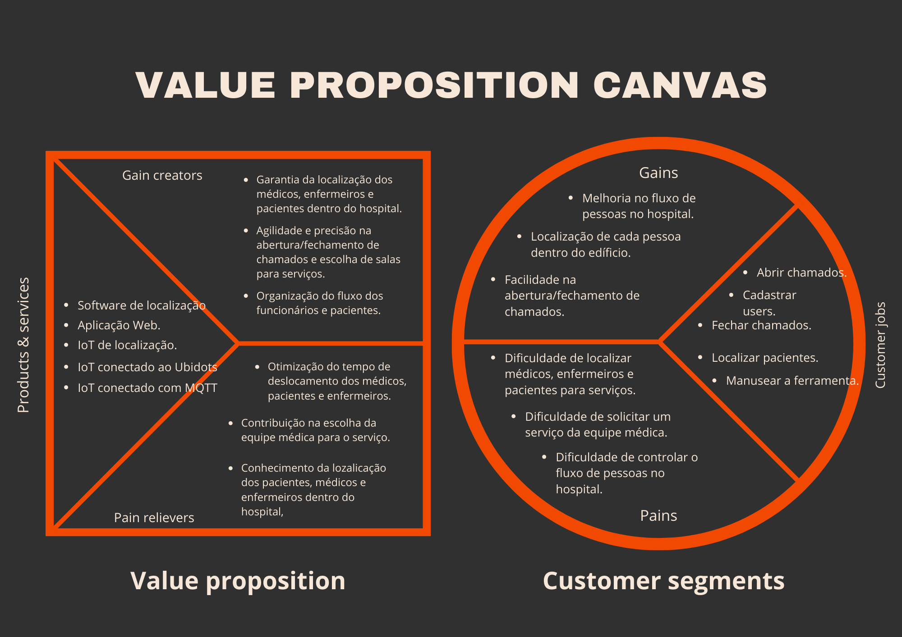
  
Fonte: elaborada pelos autores

&emsp;&emsp;Essas são as principais caracterísitcas avaliadas no desenvolvimento do nosso projeto que julgamos ter mais valor e precisam receber mais atenção. Segue a seguir o detalhamento delas:

- Criadores de ganho - Organização dos funcionáiros em serviço de emergência e agilidade na escolha dos médicos, garantia da localização dos médicos e enfermeiro quanto requisitados e salas para serviço: Aqui esta definido a "proposta de valor" da solução, o que de fato eu ganho em adquirir isso.

- Produtos e serviços - Software de localização e Software de sugestão de redirecionamento: O que de fato estamos propondo para solucionar nosso problema.

- Dores aliviadas - Otimização do tempo na transição de serviços emergências, otimização de tempo na escolha de salas de serviço e melhoria do fluxo do hospital: Quais dores e problemas iremos solucionar com nossa solução?

- Ganhos - Controle no redirecionamento e facilidade de escolha de médicos, enfermeiros e salas disponíveis: O que iremos ganhar adequando a solução no nosso sistema atual?

- Dores - Dificuldade de localizar seus companheiros de trabalho no pronto-socorro e dificuldade em redirecionar médicos e enfermeiros em serviço de emergência: Quais dores nossos clientes possuem e quais dores estamos tratando em questão?

- Função/emprego de clientes - Manusear a ferramenta e administrar a gestão dos funcionários e monitoramento do controle da disponibilidade dos médicos, enfermeiros e salas: Como a ferramenta será utilizada? O que devemos fazer para aproveitarmos 100% da sua eficiência?

### 3.1.5. Matriz de Riscos

&emsp;&emsp;A matriz de risco é uma ferramenta de gerenciamento de riscos que, de maneira visual, ajuda a identificar ameaças e oportunidades que necessitam de maior atenção, tornando mais simples a adoção de melhorias e medidas preventivas apropriadas. No contexto específico deste projeto, considerando as particularidades da equipe e analisando o mercado, foi elaborada a seguinte matriz de risco:

  
Imagem 04 - Matriz de risco

  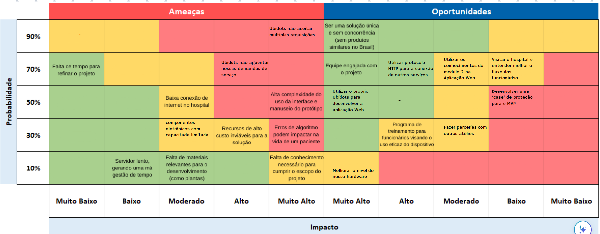
  
Fonte: elaborada pelos autores. Template disponível em https://ferramentasdaqualidade.org/matriz-de-riscos-matriz-de-probabilidade-e-impacto/

Representação detalhada da matriz de risco em ameaças e oportunidades reais e potenciais:

**Riscos reais:**

- Falta de tempo para refinar o projeto (probabilidade: 70% X impacto: muito baixo);

- Recursos de alto custo inviáveis para a solução (probabilidade: 30% X impacto: alto);

- Baixa conexão de internet no hospital (probabilidade: 50% X impacto: moderado);

- Baixo alcance do sensor (probabilidade: 90% X impacto: muito baixo);

**Riscos potenciais:**

- Falta de materiais relevantes para o desenvolvimento (como plantas) (probabilidade: 10% X impacto: moderado);

- Servidor lento, gerando uma má gestão de tempo (probabilidade: 10% X impacto: baixo);

- Alta complexidade do uso da interface e manuseio do protótipo (probabilidade: 50% X impacto: muito alto);

- Erros de algoritmo (probabilidade: 30% X impacto: muito alto);

- Falta de conhecimento necessário para cumprir o escopo do projeto (probabilidade: 10% X impacto: muito alto);

- Demora ao acessar a aplicação (probabilidade: 10% X impacto: alto);

**Oportunidades reais:**

- Ser uma solução única e sem concorrência (probabilidade: 90% X impacto: muito alto);

- Equipe engajada com o projeto (probabilidade: 70% X impacto: muito alto);

**Oportunidades potenciais:**

- Programa de treinamento para funcionários visando o uso eficaz do dispositivo (probabilidade: 30% X impacto: alto);

**Plano de ação**

&emsp;&emsp;O plano de ação são medidas a serem tomadas para lidar com os riscos identificados, fornecendo detalhes sobre como gerenciar, reduzir ou responder a eles de acordo com sua gravidade.

**Riscos reais:**

- Ao não seguir um planejamento adequado e manter a organização do projeto em mente, pode haver uma possível falta de tempo para terminar o desenvolvimento ou refinar o produto. No entanto, para evitar que isso se torne um problema, é recomendado trabalhar com as metodologias Agile e Kanban, o que permitirá a divisão eficiente das tarefas e sua conclusão dentro do prazo estabelecido.

- Contar com uma equipe que compreenda as necessidades do cliente e desenvolva uma solução com foco nesses requisitos é essencial. Dessa forma, é possível ter uma ideia do valor que o cliente está disposto a investir no produto e se ele percebe valor nessa aquisição.

- A equipe de TI deve avaliar a infraestrutura de rede do hospital, identificar pontos fracos e propor soluções para melhorar a conectividade caso haja instabilidade na rede de internet.

- Antes de idealizar uma solução, é necessário que a equipe faça testes com diferentes módulos e componentes, como sensores, para entender como funcionam. Isso permitirá o desenvolvimento de um produto com base nos recursos disponíveis, reduzindo assim o risco da falta de recursos esperados pela equipe para o projeto.

**Riscos potenciais:**

- Analisar os recursos fornecidos à equipe para identificar possíveis necessidades, visando ao desenvolvimento eficiente do produto. Se forem identificadas pendências, entrar em contato com o cliente.

- Avaliar e otimizar constantemente o servidor para que não se torne lento, uma vez que a agilidade é um elemento fundamental para abordar o problema em questão.

- Adotar princípios de design de interface e seguir as melhores práticas de usabilidade durante o desenvolvimento da interface do projeto.

- Entender as necessidades dos clientes e dos consumidores finais, especialmente no contexto em que o desafio está relacionado à falta de eficiência no serviço hospitalar. Portanto, criar uma solução que priorize a agilidade, evitando a inclusão de recursos desnecessários no protótipo e na interface que possam prejudicar a experiência dos clientes finais.

- Realizar testes rigorosamente para não deixar passar nenhum erro de algoritmo ou de lógica, visto que um erro pode causar sérios prejuízos.

- Incentivar a busca por aprendizagem, melhorias e aperfeiçoamento contínuo dos membros da equipe.

**Oportunidades reais:**

- Realizar uma análise de mercado para confirmar a inexistência de soluções concorrentes. Se essa confirmação for obtida, representaria uma excelente oportunidade para o sucesso do produto.

- Garantir uma comunicação aberta e eficaz para manter a equipe engajada e comprometida. Com uma equipe engajada, seria possível entregar um produto de alta qualidade e que atende as necessidades do cliente.

**Oportunidades potenciais:**

- Poderia haver uma colaboração entre a equipe de Recursos Humanos e os especialistas do projeto para criar um programa de treinamento aos funcionários. O programa deve abranger o funcionamento do dispositivo, boas práticas, solução de problemas e segurança. Os funcionários devem ser treinados antes do lançamento para garantir a utilização adequada e maximizar o impacto do dispositivo.

### 3.1.6. Política de Privacidade de acordo com a LGPD

&emsp;&emsp;Nossa plataforma foi projetada desde o início considerando a LGPD e suas implicações. Valorizamos a privacidade e a segurança dos dados dos nossos usuários, e estamos comprometidos em assegurar que a plataforma esteja totalmente em conformidade com a lei. Isso significa que os dados pessoais coletados dos nossos usuários serão tratados com o máximo de cuidado e respeito, garantindo a confidencialidade e a integridade das informações. Abaixo estão as informações com base na política de privacidade do Hospital Sírio-Libanês:

#### 3.1.6.1 - Informações gerais sobre a empresa/organização:

&emsp;&emsp;O Hospital Sírio-Libanês (HSL) é uma instituição privada e filantrópica, sem fins lucrativos, localizada em São Paulo e Brasília. A Sociedade Beneficente de Senhoras Hospital Sírio-Libanês é a entidade responsável pela operação do hospital.

#### 3.1.6.2 Informações sobre o tratamento de dados

&emsp;&emsp;Os dados pessoais no Hospital Sírio-Libanês, são tratados de forma transparente e de acordo com a legislação vigente, com a finalidade de melhorar os serviços de saúde e a experiência dos pacientes. O tratamento inclui a coleta com propósitos específicos, base legal clara, prazos de retenção determinados pela finalidade da coleta, informação sobre os direitos dos titulares de dados e possíveis consequências caso a recusa de fornecer dados seja obrigatória para a prestação de serviços. Tudo isso visa garantir a privacidade e segurança dos dados dos pacientes.

#### 3.1.6.3 Quais dados pessoais são coletados (inclusive os dados não informados pelo usuário, como IP, localização, etc):

&emsp;&emsp;O HSL coleta dados pessoais fornecidos ativamente pelo usuário, como nome completo, e-mail, número de telefone/celular, quando do preenchimento de formulários no site. Além disso, são coletadas informações automaticamente, como características do dispositivo de acesso, informações sobre o navegador, endereço IP com data e hora, páginas acessadas, entre outros.

#### 3.1.6.4 - Onde os dados são coletados (fonte):

&emsp;&emsp;Os dados pessoais são coletados principalmente a partir das informações fornecidas pelo usuário durante o cadastro no site. Além disso, informações automáticas são coletadas durante o uso do site.

#### 3.1.6.5 - Para quais finalidades os dados são utilizados:

&emsp;&emsp;Os dados pessoais são utilizados para fornecer serviços solicitados pelo usuário, enviar informações sobre produtos e serviços, compartilhar informações com agentes de saúde e centros de pesquisa, bem como para enviar material institucional e notícias relacionadas às atividades do HSL. A base legal para o tratamento dos dados é o consentimento do titular.

#### 3.1.6.6 - Onde os dados ficam armazenados:

&emsp;&emsp;Os dados são armazenados em um ambiente operacional seguro que não é acessível ao público.

#### 3.1.6.7 - Qual o período de armazenamento dos dados (retenção):

&emsp;&emsp;O HSL mantém os dados pessoais pelo tempo necessário para cumprir as finalidades para as quais foram coletados, incluindo obrigações legais, contratuais e regulamentares. Os dados são excluídos quando não são mais necessários ou relevantes para a prestação de serviços, a menos que haja uma obrigação legal de retenção ou necessidade de preservação para proteção dos direitos do HSL.

#### 3.1.6.8 - Uso de cookies e/ou tecnologias semelhantes:

&emsp;&emsp;O HSL utiliza cookies para melhorar a experiência de navegação do usuário, coletar informações sobre a utilização das páginas e personalizar conteúdo. São utilizados cookies necessários, funcionais e de marketing. Os usuários podem gerenciar os cookies por meio das configurações de seus navegadores.

#### 3.1.6.9 - Com quem esses dados são compartilhados (parceiros, fornecedores, subcontratados):

&emsp;&emsp;Os dados podem ser compartilhados com empresas parceiras quando necessário para a prestação de serviços, para proteção dos interesses do HSL e em conformidade com decisões judiciais ou requisitos de autoridades competentes. Além disso, informações são compartilhadas com parceiros contratados, como provedores de infraestrutura tecnológica e operacional.

#### 3.1.6.10 - Informações sobre medidas de segurança adotadas pela empresa:

&emsp;&emsp;O HSL emprega medidas técnicas de segurança e organizacionais para proteger os dados pessoais. No entanto, não pode garantir total segurança devido a possíveis ameaças como uso não autorizado de contas, falhas de hardware ou software.

#### 3.1.6.11 - Orientações sobre como a empresa/organização atende aos direitos dos usuários:

&emsp;&emsp;O HSL respeita e garante ao usuário direitos como confirmação da existência de tratamento, acesso, correção, portabilidade, eliminação, entre outros.

#### 3.1.6.12 - Informações sobre como o titular de dados pode solicitar e exercer os seus direitos:

&emsp;&emsp;O usuário pode fazer solicitações relativas aos seus dados pessoais encaminhando um e-mail para ouvidoria@hsl.org.br com o assunto "Meus Dados". O HSL tenta responder a todas as solicitações legítimas dentro de um prazo de 30 dias corridos.
Informações de contato do Data Protection Officer (DPO) ou encarregado de proteção de dados da organização:

&emsp;&emsp;O HSL fornece o e-mail dpo.hsl@lbca.com.br como meio de contato para questões relacionadas à proteção de dados.
Lembrando que essas informações são baseadas na atual política de privacidade do HSL (18/10/2023), e podem estar sujeitas a atualizações futuras. Portanto, é importante que os usuários verifiquem periodicamente a política de privacidade para estar cientes de eventuais modificações.

#### 3.1.6.13 Informações de contato do Data Protection Officer (DPO) ou encarregado de proteção de dados da organização

&emsp;&emsp;Não foi possível encontrar as informações necessárias para realizar o contato com o DPO ( Data Protection Officer) ou encarregado de proteção de dados da organização.

### 3.1.7. Bill of Material (BOM)

&emsp;&emsp;O Bill of Materials (BOM), traduzido para o português como "Lista de Materiais", é um documento detalhado que lista todos os componentes e materiais necessários para produzir um produto ou projeto específico. Ele serve como um guia para a aquisição de materiais, garantindo que todas as peças necessárias estejam disponíveis para a produção.

  
Imagem 05 - Bill of Material

  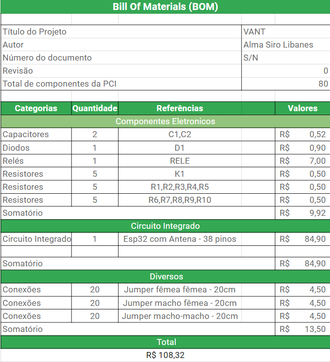
  
Fonte: elaborada pelos autores.

Na tabela apresentada, o BOM refere-se a um projeto eletrônico. Ele é dividido em diferentes categorias de componentes, como "Componentes Eletrônicos", "Circuito Integrado" e "Diversos". Para cada categoria, a tabela indica a quantidade necessária de cada componente, suas referências específicas e seus respectivos valores em reais. Ao final, é apresentado o custo total dos materiais, facilitando o planejamento financeiro e a gestão de compras.

## 3.2. Domínio de Fundamentos de Experiência de Usuário

### 3.2.1. Personas

&emsp;&emsp;Persona é a representação fictícia do seu cliente ideal. Ela é baseada em dados reais sobre comportamento e características demográficas dos seus clientes. Apresenta, também, uma criação de suas histórias pessoais, motivações, objetivos, desafios e preocupações. Uma boa definição de persona passa justamente pelo contato com o seu público-alvo. Assim, em uma rápida análise, pode-se identificar características comuns entre os potenciais compradores.

 

   <b>Imagem 06 -</b> Personas

   

      </a>
   

   Fonte: Elaboração própria

 

**Persona 1**

Informações demográficas:

- Idade: 47 anos
- Estado Civil: Casado
- Filhos: Duas crianças
- Profissão: Empresário
- Localização geográfica: São Paulo, SP

Dores, necessidades e desejos:

- Desejo de ser atendido rapidamente.
- Precisa de uma experiência de atendimento eficiente, evitando esperas prolongadas entre procedimentos.
- Acredita na importância do envolvimento do paciente no processo de cuidado.
- Espera que o hospital tenha coordenação no cuidado para evitar uso desnecessário de recursos.

**Persona 2**

Informações demográficas:

- Idade: 60 anos
- Estado Civil: Casado
- Filhos: Um adulto
- Profissão: Profissional da Saúde
- Localização geográfica: São Paulo, SP

Dores, necessidades e desejos:

- Desejo de atender o máximo de pacientes possível.
- Precisa de algo que o ajude a saber qual paciente atender primeiro.
- Acredita que a solução pode ser feita pela tecnologia.
- Espera que o a automatização seja a solução.

### 3.2.2. Jornadas do Usuário e Storyboard

&emsp;&emsp;Uma jornada do usuário é uma representação visual ou narrativa da experiência de um usuário ao interagir com um produto ou serviço ao longo do tempo. Ela descreve os passos, ações e emoções do usuário, desde a descoberta até o término da interação. Essa ferramenta é crucial para o design de experiência do usuário para identificar oportunidades de aprimoramento, garantindo que os produtos atendam às necessidades dos usuários e proporcionem uma boa experiência.

&emsp;&emsp;No desenvolvimento das jornadas de usuário, foram utilizadas duas personas previamente estabelecidas, nomeadas de Geraldo Dias e Arion dos Santos. Essas &emsp;&emsp;personas desempenharam um papel muito importante na representação das experiências do usuário, por meio da análise de suas necessidades, comportamentos e expectativas, o que possibilitou a criação de jornadas de usuário mais precisas.

  
Imagem 07 - Jornada de usuário de Geraldo Dias

  
  
Fonte: elaborada pelos autores com a plataforma Miro. Template disponível em: https://miro.com/app/dashboard/?tpTemplate=customer-journey-map-hanan&isCustom=false&share_link_id=632184165677

  
Imagem 08 - Jornada de usuário de Arion dos Santos

  
  
Fonte: elaborada pelos autores com a plataforma Miro. Template disponível em: https://miro.com/app/dashboard/?tpTemplate=customer-journey-map-hanan&isCustom=false&share_link_id=632184165677

  
Imagem 09 - Storyboard sobre a demora nos processos do PA

  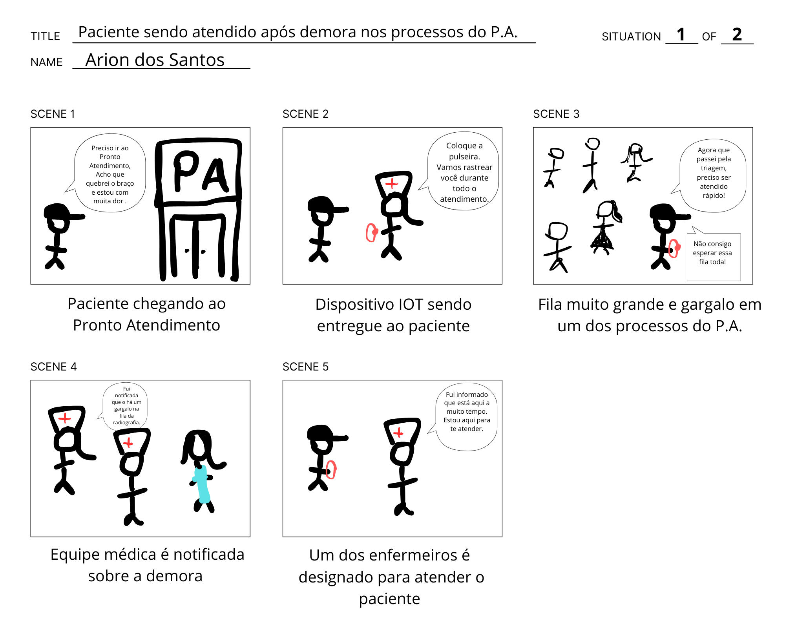
  
Fonte: elaborada pelos autores com a plataforma Canva. Template disponível em: https://www.canva.com/design/DAFyZ5dyR_E/KYNakObklQDJcvkkSb_wfQ/edit

  
Imagem 10 - Storyboard sobre casos de emergência no PA

  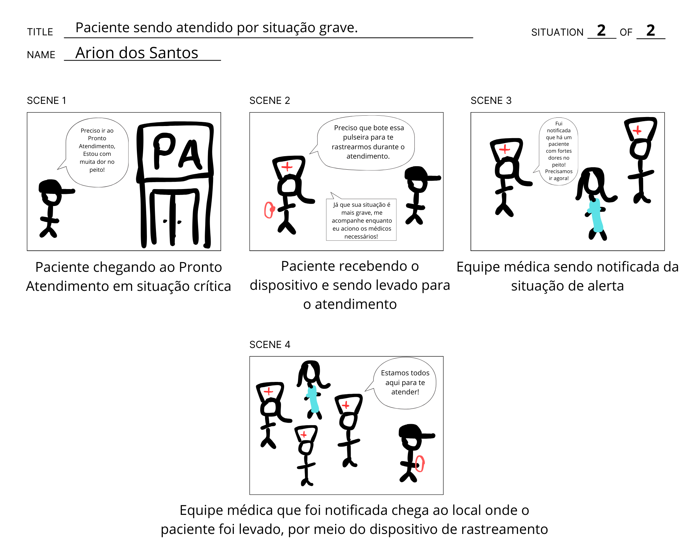
  
Fonte: elaborada pelos autores com a plataforma Canva. Template disponível em: https://www.canva.com/design/DAFyZ5dyR_E/KYNakObklQDJcvkkSb_wfQ/edit

### 3.2.3. User Stories

&emsp;&emsp;Na essência do nosso processo de desenvolvimento, as User Stories desempenham um papel central. Elas são as narrativas que orientam nossas ações, assegurando que o projeto permaneça firmemente centrado no usuário. Cada User Story é mais do que apenas uma tarefa; é uma janela para as experiências que pretendemos criar. Elas são as representações concretas das necessidades dos médicos, enfermeiros e pacientes, e nossa missão é traduzi-las em soluções práticas e eficazes. Abaixo, são apresentados cinco exemplos de User Stories que moldarão nossa primeira sprint de desenvolvimento:

#### User Story 1 (Paciente):

&emsp;&emsp;Como paciente, quero que minha localização seja identificada em tempo real, para que eu possa ser atendido de forma mais rápida e eficiente.

&emsp;&emsp;Ator: Paciente

&emsp;&emsp;Benefício: Agilidade no atendimento

&emsp;&emsp;Critérios de aceitação: A localização do paciente deve ser atualizada a cada 10 segundos e a localização deve ser precisa a uma distância de 5 metros.

&emsp;&emsp;Prioridade: Alta

#### User Story 2 (Profissional de Saúde):

&emsp;&emsp;Como profissional de saúde, quero saber a localização dos pacientes, para que eu possa priorizar o atendimento.

&emsp;&emsp;Ator: Profissional de saúde

&emsp;&emsp;Benefício: Melhor distribuição dos recursos

&emsp;&emsp;Critérios de aceitação: O profissional de saúde deve poder visualizar a localização de todos os pacientes em tempo real e o profissional de saúde deve poder filtrar a localização dos pacientes por status, equipe ou localização.

&emsp;&emsp;Prioridade: Alta

#### User Story 3 (Paciente):

&emsp;&emsp;Como paciente, quero poder enviar um sinal de emergência, para que eu possa receber ajuda mais rapidamente.

&emsp;&emsp;Ator: Paciente

&emsp;&emsp;Benefício: Melhor resposta a emergências

&emsp;&emsp;Critérios de aceitação: O paciente deve poder enviar sua localização atual com um botão de emergência e a localização do paciente deve ser enviada imediatamente para as equipes de emergência.

&emsp;&emsp;Prioridade: Alta

#### User Story 4 (Profissional de Saúde):

&emsp;&emsp;Como profissional de saúde, quero receber notificações sobre emergências, para que eu possa responder mais rapidamente.

&emsp;&emsp;Ator: Profissional de saúde

&emsp;&emsp;Benefício: Melhor resposta a emergências

&emsp;&emsp;Critérios de aceitação:O profissional de saúde deve receber uma notificação quando uma emergência é registrada e a notificação deve incluir a localização da emergência e as informações do paciente.

&emsp;&emsp;Prioridade: Alta

#### User Story 5 (Paciente):

&emsp;&emsp;Como paciente, quero poder devolver o dispositivo de localização ao sair do hospital, para que eu não seja cobrado por um dispositivo perdido.

&emsp;&emsp;Ator: Paciente

&emsp;&emsp;Benefício: Redução de custos

&emsp;&emsp;Critérios de aceitação: O paciente deve ser capaz de devolver o dispositivo de localização em um local específico do hospital e o dispositivo de localização deve ser desativado após a devolução.

&emsp;&emsp;Prioridade: Média

### 3.2.4. Protótipo de interface com o usuário

### Desenho esquemático

Um desenho esquemático é uma ilustração visual de um protótipo, apresentando através de um diagrama não apenas a operação dos componentes do circuito, mas também traçando a jornada do usuário ao interagir com o protótipo, desde o hardware até sua conexão com a nuvem e algoritmos. A compreensão de todo o funcionamento é facilitada pelos desenhos esquemáticos, que se mostram extremamente úteis na identificação e resolução de problemas quando algo não ocorre como esperado.

A seguir, são apresentadas imagens do mesmo desenho esquemático em diferentes tamanhos. Isso foi realizado para facilitar a compreensão e leitura do diagrama, que é muito extenso para ser acomodado em uma única imagem.

  
Imagem 09 - Desenho esquemático (geral)

  
  
Fonte: elaborada pelos autores com a plataforma Miro.

  
Imagem 10 - Desenho esquemático

  
  
Fonte: elaborada pelos autores com a plataforma Miro.

  
Imagem 11 - Desenho esquemático

  
  
Fonte: elaborada pelos autores com a plataforma Miro.

### Ubidots

O Ubidots é uma plataforma de desenvolvimento para IoT que facilita a integração de sistemas, eliminando a necessidade de criar um site dedicado para suportar os recursos. Esta plataforma oferece um meio seguro e simples para a construção de soluções de IoT. Ela permite o envio de dados de qualquer dispositivo com acesso à internet e, com base nesses dados, possibilita a sua visualização em diferentes widgets (ferramentas para a visualização dos dados). O Ubidots promove a tomada de decisões baseadas em dados, aproveitando recursos como visualizações sem código, alertas inteligentes, relatórios programados e análises de dados.

Foram elaborados um wireframe de baixa fidelidade e um mockup de alta fidelidade para a plataforma Ubidots. O wireframe de baixa fidelidade é uma representação simplificada que ilustra a estrutura básica da interface do Ubidots. Este recurso auxilia na visualização do layout e na organização dos elementos na plataforma. Por outro lado, o mockup de alta fidelidade é uma representação mais detalhada e precisa da interface do usuário. Este recurso possibilita a visualização de como a plataforma Ubidots se apresentará após a implementação, incluindo aspectos como cores, tipografia e gráficos.

  
Imagem 12 - Wireframe do Ubidots com baixa fidelidade

  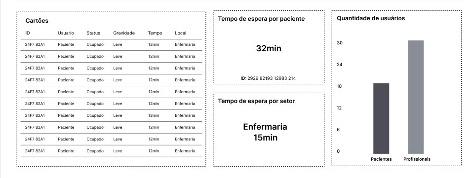
  
Fonte: elaborada pelos autores com a plataforma Figma

  
Imagem 13 - Mockup do Ubidots com alta fidelidade

  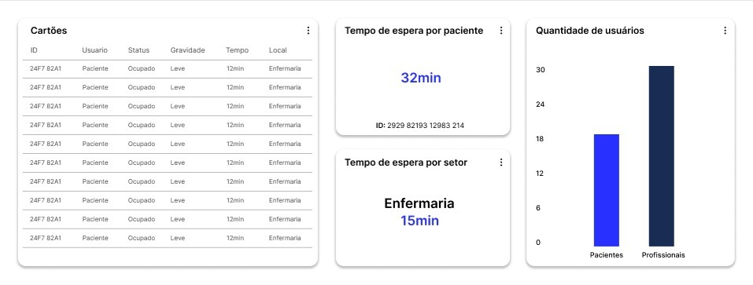
  
Fonte: elaborada pelos autores com a plataforma Figma

## 3.3. Solução Técnica

_Nesta seção, detalhe a especificação da solução, de acordo com o disposto nas subseções._

### 3.3.1. Requisitos Funcionais

### RF1 - Coleta de Dados e Identificação

O sistema deve permitir a identificação de médicos e pacientes por meio de cartões com ID e RFID.
Deve ser implementada a amplificação do sinal RFID para identificação na proximidade das portas das salas.
O sistema deve notificar quando um médico ou paciente entrar ou sair de uma sala.

### RF2 - Frequência e Precisão na Leitura das Etiquetas RFID

O sistema deve garantir uma precisão mínima para identificar em qual sala do hospital o médico ou paciente se encontra.

### RF3 - Transmissão de Dados

Os dados coletados devem ser transmitidos para o sistema central por meio de uma conexão WiFi.

### RF4 - Integração com Sistemas Existentes

Não é necessária a integração com sistemas existentes no hospital.

### RF5 - Interface de Usuário

Deve ser desenvolvido um aplicativo móvel para interação dos médicos e pessoal do hospital.
O aplicativo deve oferecer uma interface interativa para os médicos, incluindo notificações de chamados e um botão de confirmação de deslocamento.

### RF6 - Autenticação e Segurança

O acesso aos dados de localização deve ser restrito à administração do hospital para garantir a segurança e privacidade das informações.

### RF7 - Localização em Tempo Real

O sistema deve atualizar em tempo real a localização de médicos e pacientes ao entrar ou sair de cômodos.

### RF8 - Acionamento de Médicos Próximos

A determinação dos médicos mais próximos em caso de necessidade deve ser baseada na localização em tempo real.

### RF9 - Gerenciamento de Atualizações de Firmware

[Esta parte ainda precisa ser definida.]

### RF10 - Alertas e Notificações

Apenas médicos devem receber notificações de emergências, que serão emitidas por meio de vibração e alerta sonoro no celular.

### RF11 - Integração com Cadastros de Médicos

Deve ser implementada uma integração para obtenção de informações de nome e especialidade dos médicos.

### RF12 - Registro de Eventos

Não está no escopo do projeto manter um histórico, mas poderá ser adicionado na interface de administração para referência futura.

### RF13 - Feedback e Avaliação

O feedback sobre a eficácia do sistema será fornecido pessoalmente ao pessoal do hospital e não estará integrado no sistema.

### 3.3.2. Requisitos Não Funcionais

### RNF1 - Latência

O sistema deve garantir uma latência máxima de 350 milissegundos para identificar a entrada ou saída de médicos e pacientes em uma sala.

### RNF2 - Escalabilidade

O sistema deve ser capaz de lidar com um aumento de até 100% no número de dispositivos (médicos e pacientes) sem comprometer o desempenho.

### RNF3 - Consumo de Energia

O consumo de energia dos dispositivos RFID e microcontroladores ESP32 deve ser otimizado para garantir uma operação contínua e eficiente.

### RNF4 - Disponibilidade

O sistema deve estar disponível 24 horas por dia, 7 dias por semana, com uma taxa de disponibilidade de pelo menos 99%.

### RNF5 - Tolerância a Falhas

O sistema deve ser projetado para lidar com falhas de hardware ou de comunicação de forma a garantir uma operação ininterrupta.

### RNF6 - Privacidade de Dados

O sistema deve garantir a privacidade dos dados dos médicos e pacientes, cumprindo regulamentações de privacidade e proteção de dados.

### RNF7 - Interface Intuitiva para aparelho móvel

A interface do aplicativo móvel deve ser intuitiva e de fácil uso, mesmo para usuários com pouca experiência tecnológica.

### RNF8 - Tempo de Resposta

O tempo de resposta das interações do aplicativo (como notificações e confirmações) deve ser inferior a 2 segundos.

### RNF9 - Compatibilidade com Dispositivos Móveis

O aplicativo móvel deve ser compatível com os sistemas operacionais Linux, Mac e Windows.

### RNF10 - Compatibilidade com Navegadores

Plataforma compatível com os navegadores mais populares (por exemplo, Chrome, Firefox, Safari, Edge).

### RNF11 - Documentação Técnica

Deve ser fornecida documentação técnica detalhada que descreva a arquitetura, configuração e manutenção do sistema.

_Descreva quais são os requisitos não funcionais e sua relação com aspectos de qualidade (visão de aspectos de qualidade)._

### 3.3.4. Arquitetura da Solução 

&emsp;&emsp;Arquitetura de solução trata-se da projeção de tecnologia e soluções com o objetivo de esclarecer como o projeto atende as necessidades especificadas. Será apresentado no video XX a arquitetura de solução para o projeto do Sírio-Libanês, com ênfase nos processos de cadastramento dos cartões ID e no armazenamento de dados no Ubidots. É válido recordar que a arquitetura pode sofrer mudanças se necessário para melhor satisfazer o cliente.  

  
Video 1 - Demonstração da Arquitetura da Solução

  <video controls src="..\assets\Deseho esquematico - Video1.mp4">

 
 Disponivel em:  https://www.youtube.com/watch?v=Mx_3Ny49wsg 

Fonte: Elaborada pelos autores com a plataforma Figma

&emsp;&emsp;Com intuito de facilitar a análise da solução apresentada, foi desenvolvido um vídeo com narração. É válido ressaltar que a arquitetura foi desenvolvida com base nos princípios do RM-ODP, que foi estruturada de uma forma que se torne autossuficiente a qualquer tipo de tecnologia. 

### 3.3.5. Arquitetura do Protótipo

&emsp;&emsp; Nesta seção, apresentamos os frutos de um processo iterativo de aprimoramento: a arquitetura refinada da nossa solução. Este refinamento não é apenas um processo técnico; é a materialização da nossa aspiração em atender às necessidades em constante mudança do setor de saúde e tecnologia. Aqui, delimitamos o trabalho meticuloso que transformou a arquitetura original numa estrutura mais robusta, ágil e alinhada com as expectativas dos usuários e as demandas do mercado. A estrutura do nosso sistema é projetada para ser robusta e flexível, funcionando como o eixo central de nossas operações tecnológicas. Ela foi criada para se adaptar e crescer com o hospital, incorporando continuamente os insights dos usuários e os avanços no campo da tecnologia. Cada componente foi especialmente escolhido para garantir que possamos responder rapidamente às necessidades de nossos médicos, enfermeiros e pacientes, bem como aproveitar as novas oportunidades que as inovações tecnológicas oferecem. Em essência, nossa arquitetura não é estática; ela é uma estrutura dinâmica, que se expande e se ajusta para oferecer soluções eficientes e atuais para o atendimento ao paciente

&emsp;&emsp;Assim, a estrutura do protótipo engloba a configuração técnica de seus componentes e suas interações, simplificando a compreensão da arquitetura. Isso viabiliza a escalabilidade do projeto e possibilita um mapeamento mais preciso de potenciais falhas e áreas de aprimoramento. Desenvolvida utilizando a ferramenta online Miro, o vídeo 2  destaca seus principais aspectos.

  
Video 2 - Demonstração da Arquitetura do Protótipo

  <video controls src="..\assets\Arqutetura do Prototipo_video.mp4"></video>

 
 Disponivel em:  https://youtu.be/XV03e9jxScI 

Fonte: Elaborada pelos autores com a plataforma Miro

&emsp;&emsp;Com base nas informações fornecidas no vídeo e visando esclarecer mais sobre os componentes apresentados na arquitetura do protótipo, foi elaborada uma tabela que destaca os principais elementos presentes na solução, incluindo suas descrições e tipos.

| **Componente** | **Descrição** | **Tipo** |
| -------------- | ------------- | -------- |
| ESP32 (Central)| Componente responsável por registrar novos ID's       | Microcontrolador  |
| ESP32 (Portal)        | Componente encarregado de detectar o movimento da equipe médica ou dos pacientes       | Microcontrolador  |
| Cartão ID        | Componente que será carregado pelos pacientes e pela equipe médica responsável por torna-los detectaveis para os sensores       | Atuador  |
| Sensor RFID        | Componente responsável por registrar o sinal emitido pelo cartão ID e atualizar sua localização no sistema       | Emissor  |

&emsp;&emsp;O intuito das informações apresentadas é assegurar que os operadores possam identificar e compreender o funcionamento de cada componente, bem como sua função ao integrar-se com outras partes. Isso torna mais simples a implementação de melhorias e correções.

&emsp;&emsp;Assim, a arquitetura de uma solução tecnológica é a espinha dorsal que suporta cada funcionalidade e experiência do usuário. Ao concluir esta seção, enfatizamos que a arquitetura refinada que elaboramos não é apenas uma demonstração de competência técnica, mas um compromisso com a excelência. As melhorias implementadas servem como um catalisador para o crescimento contínuo e a inovação sustentável. O esforço dedicado a este refinamento assegura que a solução permanecerá resiliente diante dos desafios futuros e flexível o suficiente para se adaptar às novas oportunidades que surgirão. Com esta arquitetura, estabelecemos um padrão de qualidade e um caminho para avançar rumo a um impacto significativo e duradouro no campo da saúde digital.

&emsp;&emsp;Após uma análise criteriosa, fundamentada nos parâmetros de avaliação estabelecidos e na avaliação minuciosa realizada pelo professor orientador, identificaram-se diversas áreas passíveis de aprimoramento. Estas melhorias serão efetivamente implementadas na seção subsequente do documento, especificamente na seção 3.3.6.

### 3.3.6. Arquitetura Refinada da Solução

&emsp;&emsp; A função desta seção é melhorar e corrigir as falhas apontadas nas seções anteriores, como apontado pelo professor orientador. Logo, abordaremos a arquitetura de protótipo como ponto principal de mudança e aprimoramento.

&emsp;&emsp; Retomando como partida a seção 3.3.5, a imagem a seguir representa de maneira mais fiel e alinhada com o projeto a arquitetura que está sendo utilizada, tendo destacado seus principais componentes e agrupamentos, relacionados por função como apresentado na imagem 14:

  
Imagem 14 - Arquitetura do Protótipo

  
  
Fonte: elaborada pelos autores

&emsp;&emsp; Esta é uma visão geral sobre a arquitetura retrabalhada e revisada do projeto, com ela é possível ter entendimento do protótipo e suas interações dos usuários e do sistema como o todo. Para fins de instrução cada bloco será destacado e analizado individualmente.

  
Imagem 15 - Bloco Detecção CR

  
  
Fonte: elaborada pelos autores

&emsp;&emsp; O primeiro contato com o projeto físico se inicia pelo recepcionista atrvés do bloco de detecção, seus componentes são o sensor RFID e o cartão ID, responsáveis por essa interação.

  
Imagem 16 - Bloco Central de Recepção

  
  
Fonte: elaborada pelos autores

&emsp;&emsp; Partindo agora para o microcontrolador da central (ESP32), podemos observar as bibliotecas utilizadas dentro do bloco, responsáveis pela operação do dispositivo com os outros componentes, sendo elas o espnow para funções dentro do ESP, o WiFi para conexões sem fio, o ArduinoJson para a organização dos dados e o MQTT e o PubSubClient para a comunicação com o Ubidots.

  
Imagem 17 - Bloco Detecção Portais

  
  
Fonte: elaborada pelos autores

&emsp;&emsp; Este bloco de detecção tem como função localizar os usuários dentro do hospital por meio do mesmo sistema utilizado na recepção, possuindo os mesmos componentes mas sem a funcionalidade de cadastro. 

  
Imagem 18 - Bloco Portais

  
  
Fonte: elaborada pelos autores

&emsp;&emsp; Assim como o microcontrolador da central, podemos observar as bibliotecas utilizadas dentro do bloco, ambos possuem os mesmos componentes para sua execução e comunicação.

  
Imagem 19 - Bloco Servidor de Analises e Acionamento

  
  
Fonte: elaborada pelos autores

&emsp;&emsp; Como último bloco, o Servidor de Análise e Acionamento é responsável por reter os dados enviados pelos ESP32 e processa-los no dashboard. Os seus componentes são o Ubidots - plataforma fornecida pela faculdade para a comunicação MQTT - e o dashboard e o Banco de Dados como funcionalidades dentro dessa plataforma.

&emsp;&emsp; Entende-se o refinamento da arquitetura como um passo necessário para o projeto uma vez que permite uma melhor visão do projeto como um todo, o que permite possíveis melhorias e facilitações no debbuging de algum dos componentes. Portanto se conclui que uma vez aliado às outras seções do documento seja de grande valor.

## 3.4. Resultados

### 3.4.1.Protótipo Inicial do Projeto usando o Simulador Wokwi

&emsp;&emsp; Esta seção é dedicada a demonstrar a eficácia do nosso sistema de identificação RFID no contexto hospitalar através de uma série de simulações. Aqui, exploramos diversos cenários de interação entre os usuários - pacientes e médicos - e a tecnologia implementada, utilizando o simulador Wokwi. O foco está em validar o desempenho do sistema sob condições variadas, antecipando o comportamento do sistema frente a entradas esperadas e inesperadas. Estes testes simulados são cruciais para identificar qualquer desvio dos resultados esperados, permitindo-nos ajustar e aperfeiçoar o sistema antes de sua implantação no ambiente real. A precisão nas leituras de cartões RFID, a resposta do sistema às interações do usuário e a comunicação efetiva entre os componentes do sistema são avaliadas detalhadamente, garantindo que a solução proposta seja não apenas funcional, mas também resiliente e confiável.

| **#** | **Bloco**                             | **Componente de entrada**    | **Leitura da entrada** | **Componente de saída** | **Leitura da saída**        | **Descrição**                                    |
| ----- | ------------------------------------- | ---------------------------- | ---------------------- | ----------------------- | --------------------------- | ------------------------------------------------ |
| 01    | Identificação de usuário              | Cartão RFID válido           | ID do usuário reconhecido | LCD & LED verde         | Mostra nome e sala no LCD; LED verde acende | Quando um cartão RFID válido é apresentado, o nome do usuário e sua localização são exibidos no LCD, e o LED verde acende indicando uma leitura bem-sucedida. |
| 02    | Identificação de usuário              | Cartão RFID inválido         | ID não reconhecido     | LCD & LED vermelho      | Mostra erro no LCD; LED vermelho acende | Se um cartão RFID não cadastrado é usado, o LCD mostra uma mensagem de erro e o LED vermelho acende, indicando uma leitura falha. |
| 03    | Verificação de status do quarto       | Botão de sucesso pressionado | Sinal de botão detectado | LED verde               | LED verde pisca rapidamente | Ao pressionar o botão de sucesso, o LED verde deve piscar rapidamente, indicando que o quarto está disponível. |
| 04    | Alerta de quarto ocupado              | Botão de falha pressionado   | Sinal de botão detectado | LED vermelho            | LED vermelho fica aceso continuamente | Se o botão de falha for pressionado, o LED vermelho fica aceso continuamente, alertando que o quarto está ocupado. |
| 05    | Atualização de dados do usuário       | Cartão RFID válido           | Dados atualizados com sucesso | LCD                    | Atualiza a informação do usuário no LCD | Quando um usuário com um cartão válido entra em um novo quarto, o LCD atualiza para mostrar a nova localização. |
| 06    | Conexão com o sistema central         | Cartão RFID válido           | Transmissão de dados bem-sucedida | Sistema central       | Confirmação de recebimento de dados | Após a leitura bem-sucedida de um cartão, o sistema central recebe os dados do usuário e confirma a atualização. |
| 07    | Falha na transmissão de dados         | Cartão RFID válido           | Leitura bem-sucedida, falha na transmissão | Sistema central       | Falha na atualização de dados | Em caso de falha na rede ou no sistema central, a leitura é bem-sucedida, mas o sistema não consegue atualizar os dados do usuário. |

&emsp;&emsp;Os testes realizados demonstram a capacidade do sistema de gerenciar efetivamente a identificação e localização de pacientes e profissionais de saúde em um cenário de hospital. Com a confirmação de que os componentes de entrada e saída estão funcionando conforme esperado, temos uma base sólida para a operação contínua e confiável do sistema. É importante destacar que a identificação de falhas e a execução de correções são essenciais para a melhoria contínua do sistema. Recomenda-se que o hospital continue a monitorar a eficácia do sistema e considere a expansão de suas capacidades para acomodar futuras necessidades de inovação em cuidados de saúde.

&emsp;&emsp;Segue o link para o protótipo inicial do projeto usando o simulador Wokwi: https://wokwi.com/projects/379775821702681601

### 3.4.2. Protótipo Físico do Projeto (offline)

Nossos testes estão baseados em casos de sucesso e fracasso (não específicamos). Na nossa tabela de demonstração separamos em Bloco, componente de entrada, leitura de entrada, componente de saída, leitura de saída, descrição do teste e um registro visual do caso.  

| **#** | **Bloco**                       | **Componente de entrada** | **Leitura da entrada** | **Componente de saída** | **Leitura da saída**                   | **Descrição**                                           |
| ----- | ------------------------------- | ------------------------- | ---------------------- | ----------------------- | -------------------------------------- | ------------------------------------------------------- |
| 01    | Leds com leitura de sensor RFID | Cartão RFID               | Código ID do cartão    | Leds coloridos          | piscarem em um intervalo de 2 segundos | quando o cartão encostar no sensor RFID, ele deve ligar |

  
Imagem 20 - Protótipo Físico

  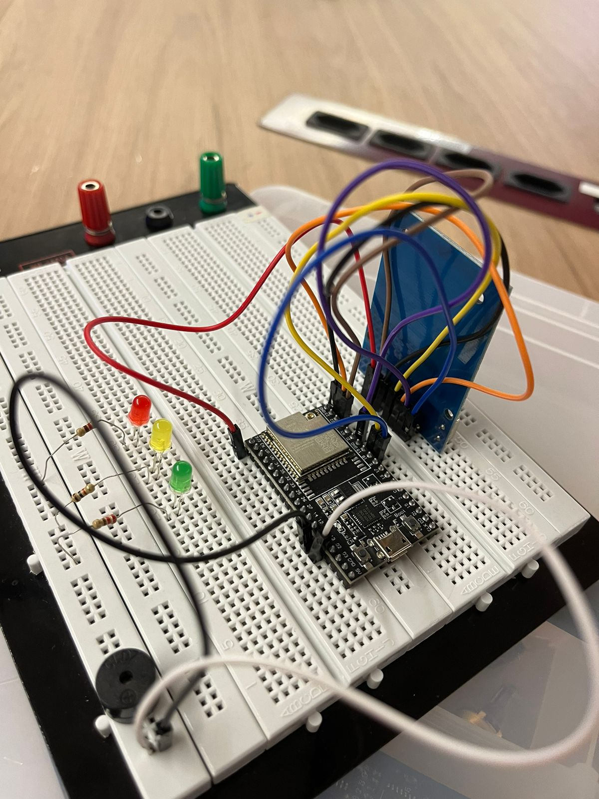
  
Fonte: elaborada pelos autores

| **#** | **Bloco**                 | **Componente de entrada** | **Leitura da entrada**     | **Componente de saída** | **Leitura da saída** | **Descrição**                                                       |
| ----- | ------------------------- | ------------------------- | -------------------------- | ----------------------- | -------------------- | ------------------------------------------------------------------- |
| 02    | Som com o buszzer no RFID | Cartão RFID               | Som de alerta com o buzzer | Buzzer                  | apitar por 1 segundo | quando encostar o cartão RFID no sensor, o buzzer deve fazer um som |

  
Imagem 21 - Protótipo Físico

  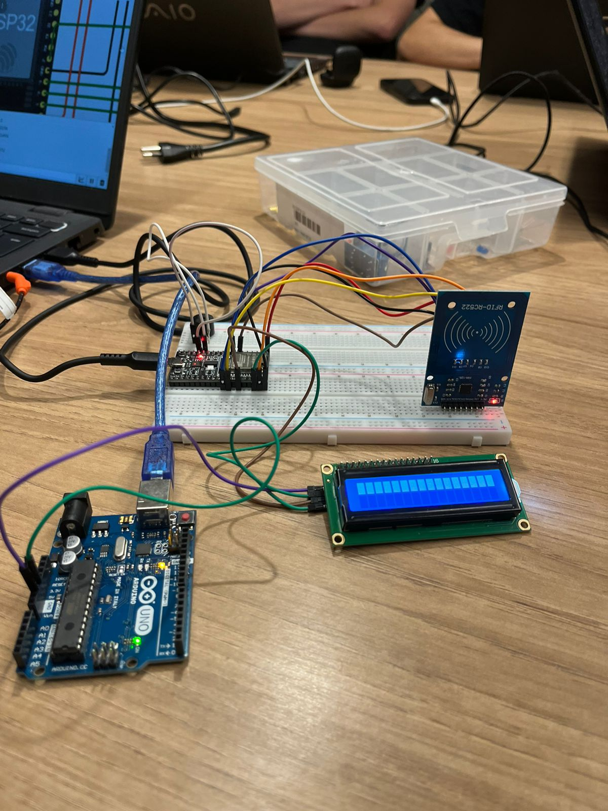
  
Fonte: elaborada pelos autores

| **#** | **Bloco**              | **Componente de entrada** | **Leitura da entrada**     | **Componente de saída** | **Leitura da saída**             | **Descrição**                                                                        |
| ----- | ---------------------- | ------------------------- | -------------------------- | ----------------------- | -------------------------------- | ------------------------------------------------------------------------------------ |
| 03    | Leitura ID cartão RFID | ID cartão                 | Cartão de entrada qualquer | Sensor RFID             | descrição do ID no Serial Output | quando encostar o cartão RFID no sensor, o Serial Output deve printar o ID do cartão |

  
Imagem 22 - Protótipo Físico

  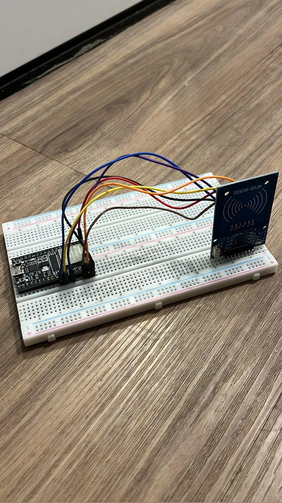
  
Fonte: elaborada pelos autores

### 3.4.3. Protótipo do Projeto com MQTT e I2C

  
Imagem 23 -  Tabela Protótipo do Projeto com MQTT e I2C

  
  
Fonte: elaborada pelos autores

&emsp;&emsp;A tabela serve como um guia para testar diferentes cenários de uso do sistema RFID em um ambiente hospitalar, cobrindo desde o registro de entrada e saída de pacientes até o monitoramento de tempo de espera, garantindo que o sistema responda apropriadamente em cada situação. Isso ajudará a equipe de desenvolvimento a validar se o sistema está funcionando conforme o esperado e identificar e corrigir falhas.

**ID**: É um identificador numérico para cada caso de uso.

**Configuração do sistema**: Descreve como o sistema deve estar preparado ou configurado antes da ação do usuário.

**Ação do usuário**: Define o que o usuário precisa fazer para interagir com o sistema.

**Resposta esperada do sistema**: Indica o comportamento ou resposta que o sistema deve ter em resposta à ação do usuário.

- **Linha 1**: Um cartão RFID está conectado ao sistema e cadastrado com os dados do usuário. Quando o usuário passa por uma porta com sensor RFID, o sistema deve receber essa informação e atualizar o banco de dados e o Ubidots (uma plataforma de IoT) em tempo real com a localização do usuário.

  
Imagem 24 -  Foto do servidor em funcionamento

  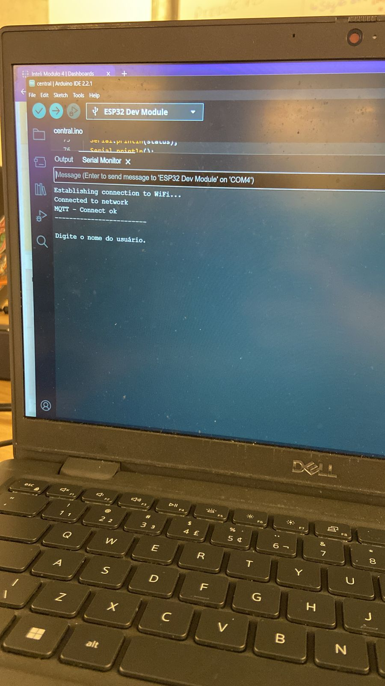
  
Fonte: elaborada pelos autores

Descrição da foto: servidor do ubidots em funcionamento.

  
Imagem 25 -  Foto da leitura do cartão RFID

  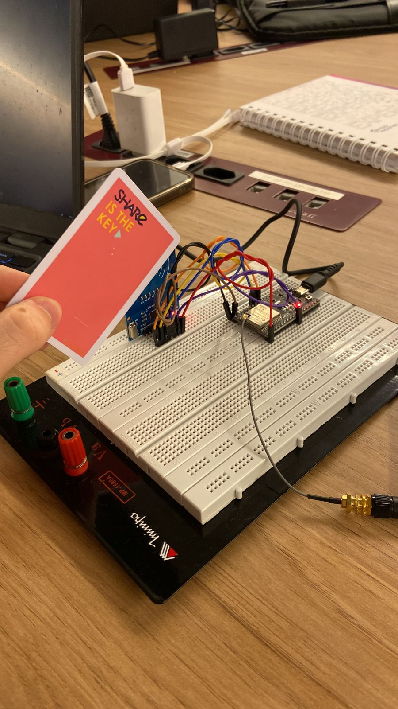
  
Fonte: elaborada pelos autores

Descrição da foto: cartão passando pelo leitor RFID. É uma demonstração do usuário passando por uma das portas acopladas com a solução no hospital.

  
Imagem 26 -  Foto das localizações de um cartão

  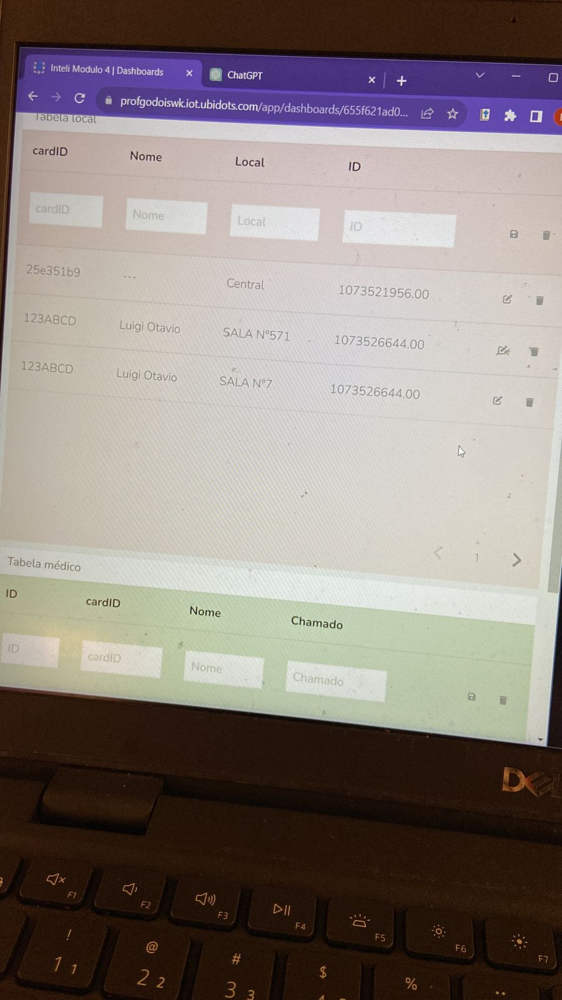
  
Fonte: elaborada pelos autores

&emsp;&emsp;
Descrição da foto: cartão cadastrado com a localização 'Sala N 571' e, logo abaixo, o mesmo cartão com a localização atualizada em 'Sala N 7', após ser lido por outro ESP.
 

- **Linha 2**: Existe uma tabela no banco de dados que indica os pacientes com casos encerrados. O usuário realiza o processo de check-in no hospital e recebe um cartão RFID. Como resposta, o sistema atualiza o status do paciente para indicar que o serviço médico começou.

- 

  
Imagem 27 -  Foto do Cadastro dentro do banco de dados

  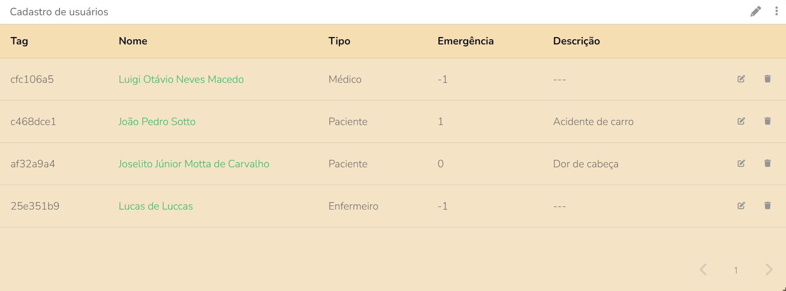
  
Fonte: elaborada pelos autores

- **Linha 3**: Similar à Linha 2, mas focada na entrega do cartão RFID ao realizar o check-out, sinalizando a conclusão dos serviços médicos. O sistema, ao receber o cartão, atualiza o status do paciente para refletir que o serviço foi concluído.

- 

  
Imagem 28 -  Foto do Status do cadastro

  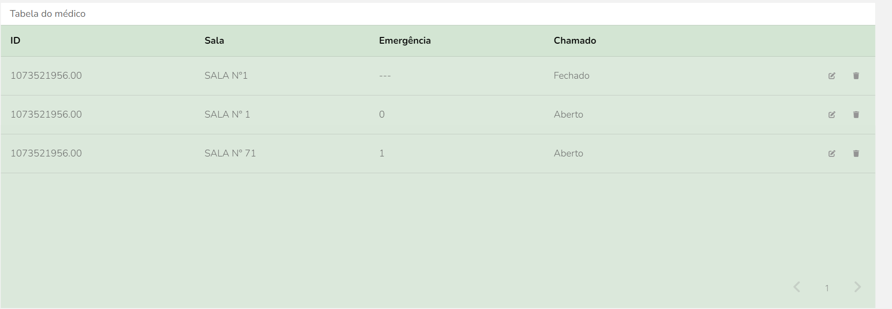
  
Fonte: elaborada pelos autores

- **Linha 4**: O sistema está preparado para o registro de novos cartões RFID para novos usuários. Quando um recepcionista registra um novo cartão para um usuário (seja paciente ou médico) através do sistema, um novo cartão é adicionado ao banco de dados com detalhes como ID, nome, classe, tempo e localização.

 

  
Imagem 29 -  Foto do cartão cadastrado

  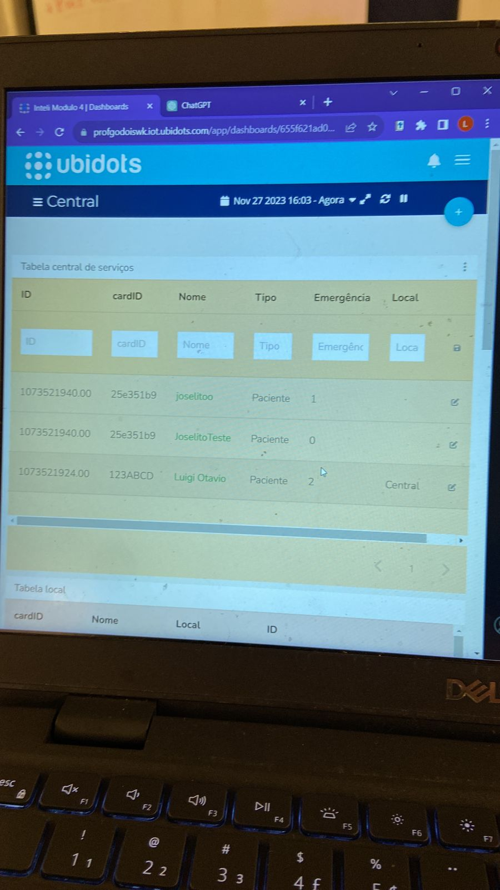
  
Fonte: elaborada pelos autores

Descrição da foto: cartão após cadastro no banco de dados e exibido em tela no UbiDots

### 3.4.4. Protótipo Físico do Projeto (online) 

&emsp;&emsp;Nessa seção da documentação, apresentamos o diagrama de fluxo da solução e UML. De forma clara, exibimos o fluxo de uma persona dentro da aplicação, muito similar ao User Story. No contexto do desenvolvimento de sistemas e projetos essas duas representações gráficas desempenham papéis cruciais ao proporcionar uma compreensão clara e abrangente das interações, estruturas e fluxos dentro de um sistema, principalmente sistemas IoTs.

&emsp;&emsp;O "Diagrama de Solução de Fluxo" oferece uma visão abrangente de um processo ou sistema, destacando suas etapas, decisões e relações. Ao mapear a sequência de eventos, torna-se uma ferramenta valiosa para identificar falhas, otimizar fluxos de trabalho e melhorar a eficiência como um todo. Essa representação visual simplifica a comunicação entre as partes interessadas, permitindo uma compreensão rápida e intuitiva do funcionamento do sistema.

&emsp;&emsp;Além disso, a "Linguagem de Modelagem Unificada (UML)" é uma linguagem padrão para modelar sistemas orientados a objetos. Ela oferece uma variedade de diagramas, cada um focado em um aspecto específico do sistema, como estrutura, comportamento e interação. No momento, estamos usando o diagrama de classe, sequência e estado por proporcionar uma visão abrangente da arquitetura, funcionamento e dinâmica do sistema, facilitando a análise, a estrutura do UX e a implementação. A seguir, segue nosso fluxo de solução baseado em organização, sequência e UML:

  
Imagem 30 -  Foto do diagrama de fluxo de solução

  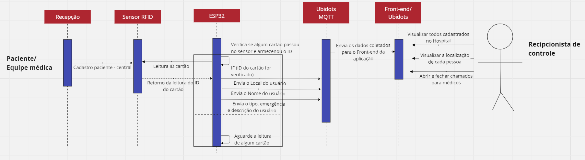
  
Fonte: elaborada pelos autores

&emsp;&emsp;O fluxo de solução do nosso projeto se baseia em uma triagem e melhoria de fluxo do hospital com ajuda de IoT. A seguir, iremos detalhar cada seção do nosso fluxo e descrever as possíveis variantes dentro do processo:

  
Imagem 31-  Foto da seção recepção do fluxo 

  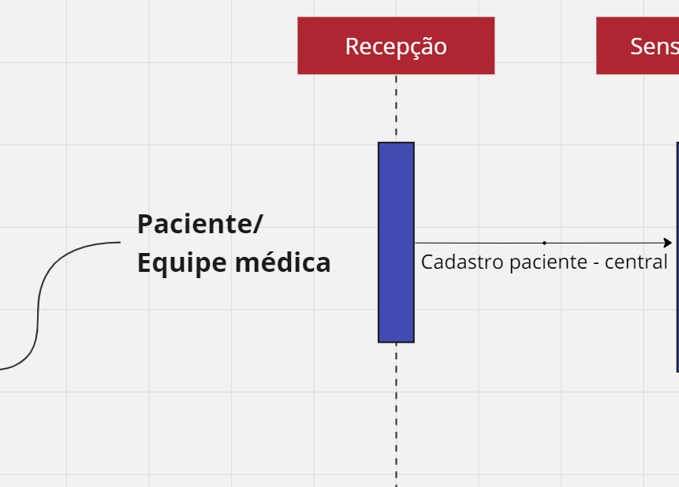
  
Fonte: elaborada pelos autores

&emsp;&emsp;Recepção:
Ao seguir o fluxo da operação no hospital, seja por parte de médicos, pacientes ou enfermeiros, é necessário passar pelo processo de triagem tradicional. Nesse contexto, vamos detalhar o procedimento para os três casos distintos: médicos, pacientes e enfermeiros (detalhamos seuas característias na seção de User Story - 3.2.3). 

  
Imagem 32 -  Foto da seção sensor RFID 

  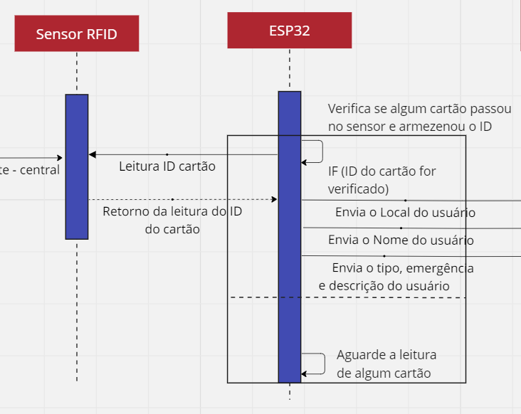
  
Fonte: elaborada pelos autores

&emsp;&emsp;Em termos de código JS e C++:
Arduino IDE/ C++ - Começamos interligando nossas conexões MQTT com nosso banco de dados do Ubidots:

    bool mqttInit() {
      WiFi.begin(WIFISSID, PASSWORD);
      while (WiFi.status() != WL_CONNECTED) {
        delay(1000);
      }
      client.setServer(SERVER, PORT);
      while(!client.connect(DEVICE_ID, TOKEN, "")) {
        return false;
      }
      return true;
    }

Logo após a conexão, nosso sistema aguarda a entrada de algum cartão:

    void readCartao(){
      // Verifica se há cartões presentes
      if (rfid.PICC_IsNewCardPresent() && rfid.PICC_ReadCardSerial()) {
        tag = "";
        tone(BUZZER_PIN, 4500);
        for (byte i = 0; i < rfid.uid.size; i++) {
          tag += (rfid.uid.uidByte[i] < 0x10 ? "0" : "");
          tag += String(rfid.uid.uidByte[i], HEX);
        }
        Serial.println();
        delay(1000); // Aguarda um segundo antes de tentar novamente
        noTone(BUZZER_PIN);
        cardRead = true;  // Indica que um cartão foi lido
      }
    }

&emsp;&emsp;Após o cartão ser lido, a TAG é enviada para o Front-end Heimdall Application.

&emsp;&emsp;Após a chegada da pessoa ao hospital, ela receberá um cartão que será escaneado por um sensor RFID, operando com ondas de rádio. Ao capturar o ID por meio do RFID, o processo de cadastro se inicia, solicitando informações como nome, emergência, tipo e descrição do caso. Este cadastro possui duas variantes: se o indivíduo for um paciente, serão requisitados todos os campos mencionados anteriormente; se for um enfermeiro ou médico, apenas o nome será solicitado. Posteriormente, as informações são enviadas por meio da conexão MQTT para o Ubidots, partindo do ESP32 para o banco de dados em nossa plataforma.

  
Imagem 33 -  Foto da seção Ubidots/MQTT e Front-end 

  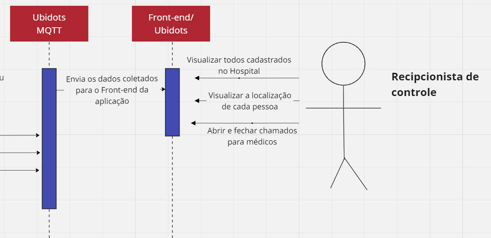
  
Fonte: elaborada pelos autores

Nessa seção, simplesmente há uma integração de formulários e envio para o Ubidots. Para isso, foi utilizado HTML  e JS:

HTML:

    

        <label for="name" class = 'rt'>Tag: </label>
    

    

        <label for="name" class = 'rt'>Nome:</label>
        <input class = 'tarea' type="text" id="tname" name="name" required>
    

    

        <label for="type" class = 'rt'>Tipo:</label>
        <select class = 'tarea' id="type" name="type" onchange="mostrarCampos()" required>
            <option value="Paciente" selected>Paciente</option>
            <option value="Enfermeiro">Enfermeiro</option>
            <option value="Médico">Médico</option>
        </select>
    

JS:

    document.getElementById('cadastroForm').addEventListener('submit', function(event) {
        event.preventDefault(); // Para prevenir o refresh da página

    var emergency = document.getElementById('temergency').value;
    var description = document.getElementById('tdescription').value;

    if (document.getElementById('type').value != "Paciente") {
        emergency = "---";
        description = "---";
    }

    var dadosInfo = {
        "value": 0,
        "context": {
            "tag": tagToRegister,
            "name": document.getElementById('tname').value,
            "type": document.getElementById('type').value,
            "emergency": emergency,
            "description": description
        }
    };

    var dadosLocal = {
        "value": 0,
        "context": {
            "tag": tagToRegister,
            "local": "Central"
        }
    };

    fetch(urlInfo, {
        method: 'POST',
        body: JSON.stringify(dadosInfo),
        headers: {
        'Content-Type': 'application/json',
        'X-Auth-Token': token
        }
    })

    fetch(urlLocal, {
        method: 'POST',
        body: JSON.stringify(dadosLocal),
        headers: {
        'Content-Type': 'application/json',
        'X-Auth-Token': token
        }
    })
    });

&emsp;&emsp;Os elementos coletados são distribuídos e organizados no front-end (Heimdall Application). Na seção de "Usuários", é possível visualizar os dados coletados de todas as pessoas no hospital, incluindo sua localização exata. A funcionalidade "Local" é atualizada a cada nova porta atravessada, exibindo o nome da sala em que a pessoa se encontra. Ao final deste processo, o recepcionista de controle (enfermeiro/médico intermediador) tem a capacidade de visualizar o fluxo de pessoas no hospital, observar a localização de cada indivíduo e abrir ou fechar chamados médicos, que serão exibidos no front-end destinado aos médicos. Esse seria o fluxo esperado. Entretanto, o nosso sistema trabalha bem com fluxos distindos, como: se o cartão não for lido, não será possível abrir ficha de cadastro; 

Em relação aos casos de teste do fluxo, desenvolvemos o seguinte fluxo:

| *#* | *Configuração do Ambiente* | *Ação do Usuário* | *Resposta Esperada do Sistema* | *Resposta Recebida do Sistema* |
| ----- | ---------------------------- | ------------------- | -------------------------------- | ---------------------------------------------- |
| 01    | O microcontrolador ESP32 faz sua primeiraconexão com o banco de dados da nuvem, Ubidots. O RFID fica disponível para captura de ID e agurada uma proximidade paraprosseguir com o cadastro.   | Aproximar o cartão do sensor RFID para prosseguir com o cadastro.   | O cartão foi lido com sucesso e agora o formulário de cadastro segue adiante, solicitando informações como: nome, tipo, emergência, descrição e local.         |   O sistema identificou o cartão e abriu seu formulário para continuar o cadastro do paciente, médico ou enfermeiro. |
| 02    |  Utilização da plataforma do Ubidots com o componente "HTML Canvas" para a criação de um front-end dinâmico e integrado ao back-end do próprio Ubidots. | O intermediador da plataforma, irá fazer cadastro de pessoas, monitorar o fluxo no hospital, abrir e fechar chamados e controlar o painel administrativo.   | Visualização dos dados na plataforma e opção de manusear todas as ferramentas existentes.            |                O intermediador consegue abrir e fechar chamados, fazer cadastros, monitorar o fluxo do hospial. Entretanto, o médico ainda não consegue aceitar esses chamados, ficando apenas a mensagem "pendente" nas solicitações.                 |
| 03    |  Utilização do front-end (Heimdall Apllication) para abrir e fechar chamados para médicos no hopital | O intermediador da plataforma, por meio da seção chamados, irá abrir chamados inserindo o local do serviço e fechar chamados seguindo a mesma lógica   | Na seção "Emergência", o chamado aberto deverá estar com o nome da sala de abertura e status pendente, enquanto nenhum médico aceita o serviço.           |                Os chamados já podem ser abertos e fechados, mas não aceitos. Não há nenhum meio no qual os médicos possam aceitar chamados e alterar os status de "pendente" para "aceito".                 |

  
<b>Fonte:</b> elaborada pelos autores.

  

### 3.4.5. Protótipo Final do Projeto

&emsp;&emsp; Esta seção tem como propósito corrigir, revisar e aprimorar os conceitos relacionados ao diagrama de solução e à UML, conforme abordado no tópico 3.4.4. Importante destacar que, desde a última atualização, não foram aplicadas alterações significativas. A seção 3.4.5, que aborda tais conceitos, foi cuidadosamente validada e recebeu a devida autorização do professor orientador responsável pelo panorama de programação do projeto, bem como pela documentação.

&emsp;&emsp;A seguir, elaboramos um vídeo onde demonstramos e narramos o diagrama de sequência da solução junto ao projeto físico. O objeitvo desse vídeo é facilitar e detalhar a compreensão do fluxo da solução combinado ao protótipo na prática.

  
Video 3 - Demonstração do diagrama de arquitetura e sequência

  <video controls src="./outros/imagens/diagramadesequencia.mp4"></video>

 
 Disponivel em:  https://www.youtube.com/watch?v=Ht63QHK600k 

Fonte: Elaborada pelos autores com a plataforma Miro

&emsp;&emsp;A seguir, apresentamos imagens finais da dashboard e do protótipo físico.

  
Imagem 27 - Demonstração da plataforma Heimdall

  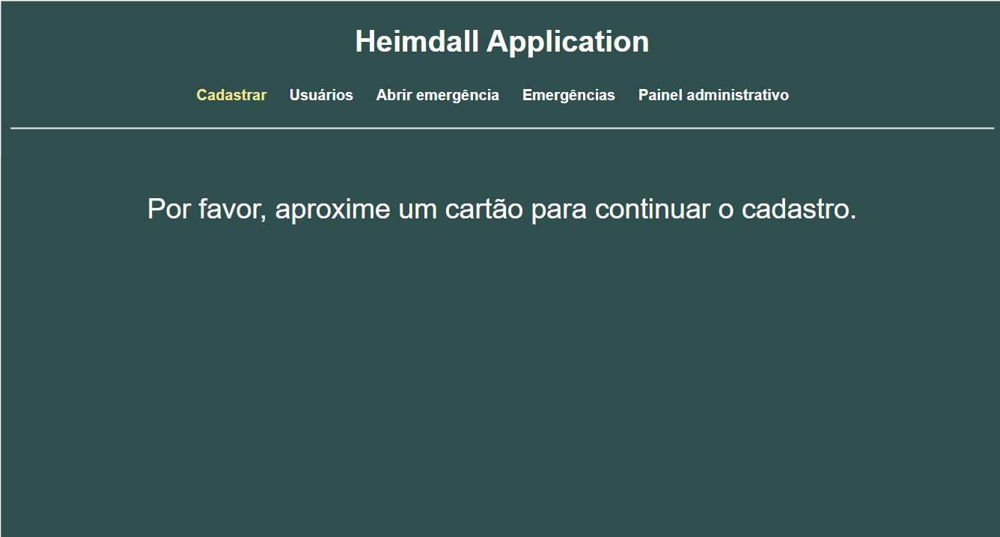

Fonte: Elaborada pelos autores com a plataforma Miro

&emsp;&emsp;Nessa seção, a plataforma aguarda a entrada de algum cartão para o início do cadastro.

  
Imagem 28 - Demonstração da lista de usuários da plataforma Heimdall

  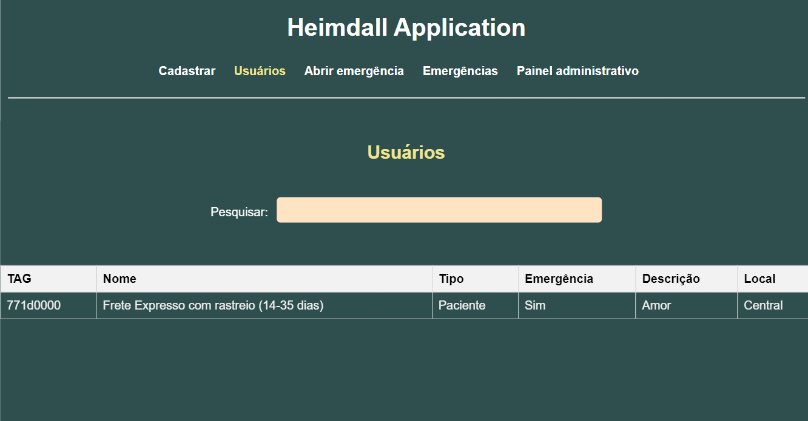

Fonte: Elaborada pelos autores com a plataforma Miro

&emsp;&emsp;Após o cadastro, os usuários são exibidos na seção usuários.

  
Imagem 29 - Demonstração das emergências da plataforma Heimdall

  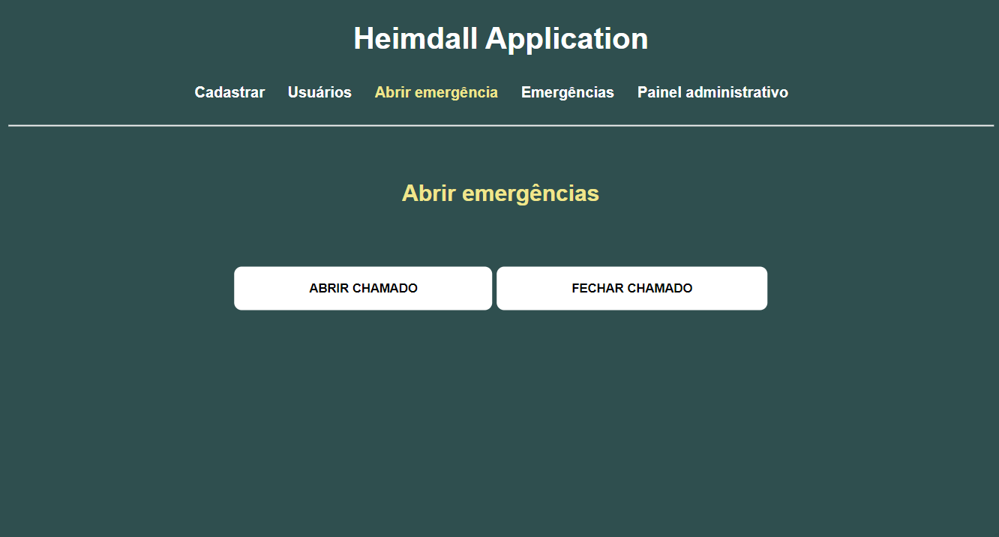

Fonte: Elaborada pelos autores com a plataforma Miro

&emsp;&emsp;Na seção, "Abrir emergência", o intermediador pode abrir ou fechar chamados de serviços médicos.

  
Imagem 30 - Demonstração da lista de emergências da plataforma Heimdall

  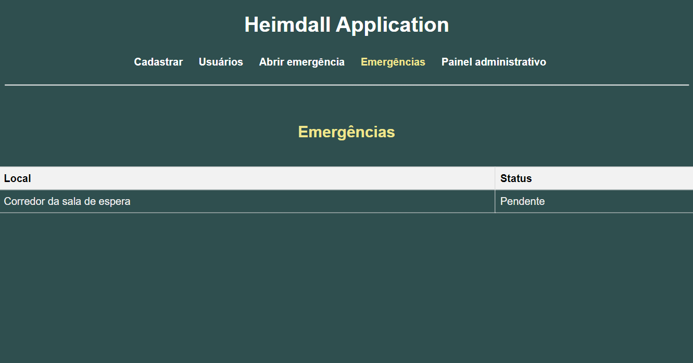

Fonte: Elaborada pelos autores com a plataforma Miro

&emsp;&emsp;Já em "Emergências", o intermediador visualiza a lista dos chamados abertos. Os chamados fechados desaparecem da lista de serviços médicos.

  
Imagem 31 - Demonstração do painel administrativo da plataforma Heimdall

  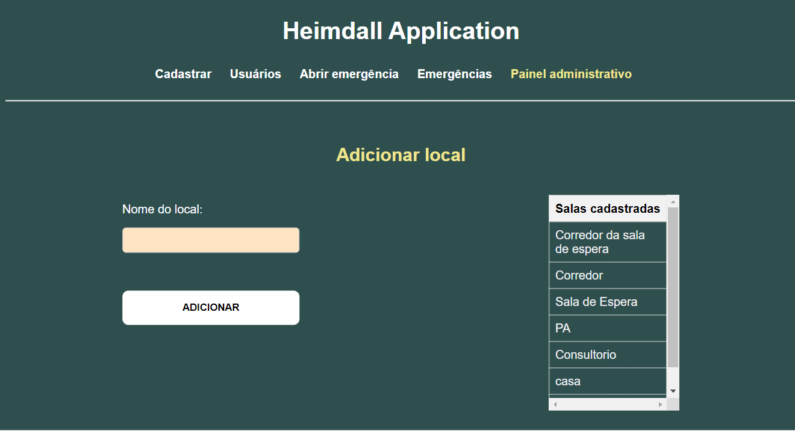

Fonte: Elaborada pelos autores com a plataforma Miro

&emsp;&emsp;No painel adiministrativo, o intermediado pode adicionar novas salas para abrir e fechar chamados.

### 3.4.6 Testes de Usabilidade

#### Introdução

&emsp;&emsp; A seção "Testes de Usabilidade" reflete nosso compromisso em aprimorar continuamente a solução proposta para o monitoramento de pacientes e equipe de saúde em ambientes hospitalares. A necessidade desta seção emerge da essencialidade de validar a eficácia, eficiência e satisfação proporcionadas pelo uso do protótipo em condições reais. Através dos testes de guerrilha, buscamos um feedback rápido e valioso, que se traduz em melhorias significativas na experiência do usuário final. Este processo é uma peça chave no desenvolvimento centrado no usuário, garantindo que o produto final não só atenda às expectativas dos stakeholders, mas também supere-as. O registro detalhado desses testes e seus resultados aqui compartilhados é um testemunho da nossa abordagem iterativa e responsiva para a entrega de uma solução robusta e alinhada com as demandas práticas do campo da saúde.

&emsp;&emsp;Para uma compreensão completa dos resultados, benefícios e objetivos desses testes de usabilidade, bem como para visualizar a tabulação e análise dos dados coletados, convidamos os interessados a acessar a documentação completa por meio do seguinte link: [Tabulação de Testes de Usabilidade](https://docs.google.com/spreadsheets/d/1NM27oTWCW5rupVhcDj0owfpl8A88SCtFGGkZtvzlxHw/edit#gid=0)

Imagem 34 - Tabela de Testes de Usabilidade (Registros dos testes)

  
    
Fonte: Grupo Heimdall

#### Contexto dos Testes

&emsp;&emsp;Os testes de usabilidade foram realizados no Instituto de Tecnologia e Liderança (Inteli), no dia 13 de dezembro de 2023. Os participantes eram principalmente alunos e docentes da instituição, com familiaridade em tecnologias similares às empregadas no desenvolvimento da solução, o que possibilitou uma avaliação crítica e técnica. Apesar de seu conhecimento técnico, esforçamos para assegurar que os testes refletissem a experiência de usuários típicos em um ambiente hospitalar, conscientes de que um público diversificado poderia oferecer uma perspectiva diferente.

&emsp;&emsp;Os testes foram conduzidos no período da nossa instrução de manhã, com cada participante sendo instruído a interagir com o protótipo e o manual de instruções sem assistência prévia. Isso permitiu que a equipe observasse como os usuários naturais descobririam e utilizariam os recursos do sistema. O ambiente foi preparado para simular o contexto de um hospital, com áreas designadas representando diferentes estações de trabalho médico.

&emsp;&emsp;A aplicação dos testes seguiu uma metodologia estruturada com foco na experiência do usuário, desde a montagem inicial do hardware até a interação com a interface de software. As tarefas foram projetadas para abranger todos os aspectos cruciais da operação do sistema, testando a capacidade dos usuários de seguir as instruções do manual e de usar o sistema de maneira eficiente e intuitiva.

#### Problemas Detectados e Resultados Obtidos

&emsp;&emsp;Os testes de usabilidade revelaram alguns desafios significativos que os usuários enfrentaram ao interagir com o protótipo e o manual de instruções. Foi identificado que a montagem dos componentes não estava intuitiva, com a colocação dos jumpers próxima demais, dificultando a manipulação. Também foi notada a necessidade de uma explicação mais clara sobre o propósito e funcionamento de cada porta do ESP32, e a inserção da antena mostrou-se um processo mais complexo do que o previsto, demandando instruções mais detalhadas.

&emsp;&emsp;As imagens do manual de instruções, especialmente antes da seção 6, apresentaram-se pequenas demais para uma visualização adequada. Além disso, a ausência de um log de atualizações para as ações dos médicos foi apontada como uma lacuna importante, considerando o risco de falhas técnicas que poderiam comprometer o rastreamento de movimentações no ambiente hospitalar. Essas questões, apesar de representarem obstáculos, forneceram dados valiosos que refletiram positivamente no processo de refinamento da solução.

Imagem 35 - Tabela de Testes de Usabilidade (Ocorrências)

  
    
Fonte: Grupo Heimdall

#### Próximos Passos

&emsp;&emsp;Com base nos problemas identificados, uma série de ações corretivas será implementada para garantir a usabilidade e a eficiência do sistema. A primeira etapa incluirá uma revisão e reestruturação do manual de instruções para torná-lo mais compreensível e de fácil seguimento. As imagens serão redimensionadas e novas serão adicionadas para facilitar a visualização e compreensão dos procedimentos. A ordem de montagem do protótipo será reorganizada para evitar a colocação de jumpers adjacentes, reduzindo a complexidade e o risco de erros durante a montagem.

&emsp;&emsp;Um registro de log será desenvolvido para capturar as atualizações de movimentação dos médicos, permitindo que a administração do hospital tenha uma visão clara das últimas atividades realizadas antes de qualquer incidente técnico. Adicionalmente, será incluído um guia de solução de problemas detalhando as ações a serem tomadas caso a bateria do dispositivo esteja prestes a se esgotar, assegurando que o sistema permaneça operacional e confiável em todos os momentos.

#### Conclusão

&emsp;&emsp;A realização dos testes de usabilidade, sob a metodologia de guerrilha, trouxe à tona insights valiosos sobre a interação dos usuários com o protótipo desenvolvido para o Hospital Sírio-Libanês. A inclusão de uma tabela detalhada (imagem 27), foi uma etapa crítica para documentar e analisar os resultados dos testes. Esta tabela não só capturou os sucessos e desafios enfrentados pelos usuários em diferentes etapas do processo, mas também serviu como uma ferramenta de comunicação transparente e um registro objetivo do desempenho do sistema.

&emsp;&emsp;Os benefícios desses testes foram múltiplos: eles nos permitiram avaliar a solução sob uma nova perspectiva, entender profundamente as necessidades dos usuários e identificar áreas específicas para melhorias imediatas. Ao mesmo tempo, os testes fortaleceram a colaboração entre a equipe de desenvolvimento e os futuros usuários do sistema, estabelecendo uma base sólida para iterações futuras.

## 4. Possibilidades de Descarte

&emsp;&emsp;Nesta seção, abordamos um dos aspectos mais críticos e frequentemente subestimados no desenvolvimento de tecnologias inovadoras: o descarte responsável e sustentável dos materiais utilizados. Como demonstrado em estudos de caso de gerenciamento de resíduos RFID,conforme mencionado no artigo [Economia Circular e Lixo Eletrônico: Uma Oportunidade das TAGs RFID](https://www.mdpi.com/2076-3417/9/16/3422), a tecnologia RFID desempenha um papel fundamental na economia circular, otimizando a reciclagem, aumentando a reutilização e reduzindo os resíduos enviados para aterros​Ao projetar e implementar soluções tecnológicas, como o nosso protótipo de MVP que utiliza sensores RFID, microcontroladores, baterias, placas de circuito impresso (PCBs) e carcaças de plástico, é fundamental considerar o ciclo de vida completo dos materiais envolvidos.

&emsp;&emsp;Esta seção detalha os materiais específicos utilizados no nosso MVP, suas respectivas expectativas de vida útil, e fornece diretrizes claras e práticas para o descarte adequado de cada componente. O objetivo é assegurar que todos os passos, desde a utilização até a disposição final, sejam conduzidos de forma a minimizar os impactos ambientais negativos. Como ilustrado por casos em Estocolmo, Barcelona e Singapura, conforme mencionado no artigo [Tecnologia RFID para gestão e rastreamento de resíduos perigosos](https://www.recyclingtoday.com/article/wastequip-rfid-software/), a tecnologia RFID é utilizada para otimizar rotas de coleta de resíduos, monitorar taxas de reciclagem e garantir a conformidade com as regulamentações ambientais

&emsp;&emsp;Determinamos as orientações de descarte considerando a toxicidade potencial e os riscos ambientais associados a cada tipo de material. A responsabilidade ambiental é um pilar central deste projeto, e a conscientização sobre as consequências do descarte inadequado é essencial. Portanto, esta seção serve não apenas como um guia prático, mas também como uma forma de conscientizar para práticas sustentáveis e conscientes no gerenciamento de resíduos eletrônicos, contribuindo assim para um futuro mais verde e responsável.

Material | Vida Útil Estimada | Método de Descarte | Riscos Ambientais | Orientações Adicionais
--- | --- | --- | --- | ---
Sensores RFID | 5-10 anos | Entrega a pontos de coleta de e-waste | Toxicidade do solo e água por metais e plásticos | Desmonte seguro e separação de componentes em centros especializados.
Microcontroladores (ex: ESP32) | 5-10 anos | Entrega a pontos de coleta de e-waste | Liberação de gases tóxicos e metais pesados | Remoção de baterias e desmonte em locais com ventilação adequada para evitar inalação de gases.
Baterias (ex: Lítio-íon) | 2-3 anos | Programas de reciclagem de baterias | Contaminação do solo e da água, risco de incêndio | Armazenamento em locais secos e frescos antes da reciclagem, para evitar reações químicas perigosas.
Placas de Circuito Impresso (PCBs) | 10-20 anos | Entrega a pontos de coleta de e-waste | Acumulação de substâncias tóxicas na cadeia alimentar | Manuseio cuidadoso para evitar a dispersão de partículas.
Carcaças de Plástico | 50-80 anos | Reciclagem de plásticos ou recuperação de energia | Poluição por microplásticos, riscos à vida marinha | Encaminhamento para reciclagem especializada onde o plástico pode ser reprocessado.

&emsp;&emsp;A gestão responsável do fim de vida dos componentes do nosso MVP é crucial para mitigar impactos ambientais e assegurar a sustentabilidade. Abaixo, detalhamos protocolos de descarte aprimorados para cada material utilizado no projeto, com ênfase especial na segurança, eficácia e conformidade ambiental. Este alinhamento com práticas globais de gestão de resíduos sustentáveis, reforça o compromisso do nosso projeto com a sustentabilidade e a responsabilidade ambiental,​ conforme destacado nas diversas aplicações da tecnologia RFID para gerenciamento de resíduos, no artigo [Tecnologia RFID para gestão e rastreamento de resíduos perigosos](https://journals.sagepub.com/doi/10.1177/0734242X14536463).

#### Sensores RFID e Microcontroladores

&emsp;&emsp;Desativação e Desmontagem: Antes do descarte, estes dispositivos devem ser completamente desativados para evitar qualquer vazamento de dados. O desmonte deve ser realizado em um ambiente controlado, onde os componentes eletrônicos são separados por tipo (metais, plásticos, baterias).

&emsp;&emsp;Reciclagem Especializada: Os componentes segregados devem ser enviados a instalações de reciclagem certificadas que possuam processos específicos para cada tipo de material, garantindo a recuperação eficiente de recursos e a minimização da contaminação ambiental.

#### Baterias de Lítio-íon

&emsp;&emsp;Manuseio e Descarte Cautelosos: Dada a natureza volátil das baterias de lítio-íon, é imprescindível que sejam manuseadas e armazenadas com extremo cuidado para evitar acidentes, como incêndios ou vazamentos químicos.

&emsp;&emsp;Programas de Reciclagem Específicos: As baterias devem ser entregues a programas de reciclagem especializados, onde os materiais podem ser tratados e neutralizados de forma segura, evitando a liberação de substâncias nocivas ao meio ambiente.

#### Placas de Circuito Impresso (PCBs)

&emsp;&emsp;Processamento Cuidadoso: As PCBs contêm uma variedade de metais tóxicos e precisam ser processadas em instalações equipadas para lidar com esses componentes de forma segura, evitando a liberação de substâncias perigosas no meio ambiente.

&emsp;&emsp;Recuperação de Materiais: O processo de reciclagem deve focar na recuperação de metais valiosos e na destinação segura dos componentes tóxicos, garantindo a redução da pegada ecológica.

#### Carcaças de Plástico

&emsp;&emsp;Reciclagem Prioritária: O plástico deve ser encaminhado para reciclagem sempre que possível, transformando-o em novos produtos e reduzindo a necessidade de novos recursos plásticos.

&emsp;&emsp;Recuperação de Energia: Em casos onde a reciclagem não é viável, o plástico pode ser utilizado em processos de recuperação de energia, como a incineração em instalações controladas, gerando energia de forma mais sustentável.

&emsp;&emsp;Documentação do Processo de Descarte: É crucial documentar e rastrear o processo de descarte de cada componente, assegurando que foram tratados e reciclados de acordo com as normas ambientais.

&emsp;&emsp;Auditorias Regulares: Deve-se realizar inspeções regulares nas instalações de reciclagem para assegurar a aderência aos padrões ambientais e procedimentos de segurança.

&emsp;&emsp; Política de Retorno de Produto (Take-back): Incentivar a prática de retorno dos produtos ao fabricante após o fim de sua vida útil, promovendo a reciclagem e reuso de materiais.

&emsp;&emsp;Educação e Conscientização: Implementar campanhas educativas para sensibilizar a comunidade sobre a importância do descarte responsável e práticas sustentáveis.

#### Conclusão

&emsp;&emsp; Tendo em vista todas essas informações, é possível concluir que essa seção de possibilidades de descarte reflete nosso compromisso com a sustentabilidade e a responsabilidade ambiental no desenvolvimento e implementação de soluções tecnológicas. Ao longo desta seção, enfatizamos a importância de um planejamento cuidadoso e consciente em relação ao ciclo de vida dos componentes do nosso MVP, desde a utilização até o descarte final.

&emsp;&emsp;Os protocolos de descarte detalhados para cada tipo de material (sensores RFID, microcontroladores, baterias de lítio-íon, placas de circuito impresso e carcaças de plástico) foram projetados para minimizar o impacto ambiental, respeitando normas de segurança e de sustentabilidade. Com base na análise de cada material, oferecemos orientações práticas para o descarte apropriado, considerando os riscos ambientais associados e as melhores práticas de reciclagem e recuperação de materiais.

&emsp;&emsp;Nossa abordagem não se limita apenas aos aspectos técnicos do descarte, mas estende-se à gestão ambiental holística, incluindo a documentação do processo de descarte, auditorias regulares em instalações de reciclagem, políticas de retorno de produto e campanhas educativas para promover a consciência ambiental. Essas práticas demonstram nosso esforço para ir além do cumprimento das regulamentações ambientais, buscando ativamente reduzir a pegada ecológica do nosso projeto e promover um futuro mais sustentável.

&emsp;&emsp;Esta seção serve como um modelo para a gestão responsável de resíduos eletrônicos, destacando a importância da integração de práticas ambientais sustentáveis em todas as etapas do desenvolvimento de produtos tecnológicos. Esperamos que este documento não apenas atenda aos padrões ambientais e de segurança, mas também inspire outras iniciativas a adotar práticas semelhantes, contribuindo para um impacto ambiental positivo e duradouro.

## 5. Conclusões e Recomendações

&emsp;&emsp;No contexto do projeto colaborativo entre o nosso time de desenvolvimento e o Hospital Sírio-Libanês, o protótipo de IoT desenvolvido ultrapassou as expectativas iniciais, alcançando e expandindo os objetivos estratégicos propostos. Através da implementação do sistema RFID interconectado com a plataforma Ubidots, o projeto demonstrou uma capacidade excepcional de melhorar a experiência de cuidados de saúde, otimizando o gerenciamento de fluxos de pacientes e a alocação de recursos em um ambiente hospitalar dinâmico.

&emsp;&emsp;O sistema foi meticulosamente projetado para se alinhar com os processos do hospital, aumentando a eficiência operacional e o atendimento ao paciente. A solução IoT oferece uma visão clara da localização e do movimento tanto dos pacientes quanto do corpo clínico, permitindo uma resposta rápida e eficiente em situações críticas, o que é essencial em um ambiente hospitalar. Além disso, a habilidade do sistema de se integrar com as operações existentes do hospital sem perturbar os fluxos de trabalho estabelecidos demonstra sua versatilidade e facilidade de implementação.

&emsp;&emsp;O protótipo foi avaliado por meio de uma série de testes de funcionalidade, desempenho e usabilidade. Estes testes, documentados nas seções 3.4.4 e 3.4.5, forneceram dados valiosos, confirmando que o sistema não só atende aos requisitos técnicos mas também apoia a missão do hospital de fornecer cuidados de saúde excepcionais. Os resultados indicaram que o protótipo pode diminuir significativamente os tempos de espera, melhorar a comunicação interna e aumentar a satisfação geral dos pacientes.

&emsp;&emsp;Com base nesses resultados promissores, as seguintes recomendações são formalmente apresentadas ao Hospital Sírio-Libanês para a incorporação e expansão contínua desta solução IoT:

- Adoção Progressiva: Implementar o sistema de forma progressiva, iniciando com departamentos críticos, como emergência e UTI, antes de uma implantação hospitalar completa.

- Treinamento e Desenvolvimento Profissional: Investir no desenvolvimento profissional contínuo, certificando que todos os usuários estejam capacitados a operar o sistema com confiança e competência.

- Inovação Tecnológica: Continuar a pesquisa e o desenvolvimento para incorporar avanços tecnológicos que possam melhorar ainda mais a solução.

- Feedback para Melhoria Contínuo: Estabelecer um sistema de feedback com os usuários para identificar rapidamente áreas para refinamento e atualizações do sistema.

- Gestão Ambiental e Sustentabilidade: Promover o descarte ecológico dos componentes eletrônicos, seguindo as diretrizes estabelecidas na seção 4, reforçando o compromisso do hospital com práticas sustentáveis.

- Proteção e Segurança dos Dados: Assegurar que as práticas de segurança dos dados estejam sempre atualizadas para proteger as informações confidenciais dos pacientes.

- Interconexão com Sistemas Hospitalares: Considerar a integração do sistema com outras ferramentas e plataformas hospitalares para fornecer uma visão unificada dos cuidados ao paciente.

- Análise de Dados e Inteligência Artificial: Utilizar a análise de dados e IA para prever tendências, identificar padrões e melhorar a tomada de decisões baseada em dados.

- Aprimoramento da Interface do Usuário: Refinar continuamente a interface do usuário, com base nos testes de usabilidade, para assegurar que a solução seja intuitiva e acessível para todos os usuários.

&emsp;&emsp;O protótipo desenvolvido representa uma junção estratégica entre a inovação tecnológica e a missão de saúde do hospital. A solução oferecida não só atende aos objetivos do projeto como abre caminho para avanços futuros na prestação de cuidados de saúde. Recomenda-se que o Hospital Sírio-Libanês considere a adoção e expansão desta solução IoT como um componente central da sua visão de longo prazo para a inovação em saúde, garantindo que continue a oferecer um atendimento ao paciente que é tanto compassivo quanto tecnicamente avançado.

## 6. Referências

Heimdall: The Origin of His Name and Role in Norse Mythology. 2023. Disponível em: [Museum of Mythology](https://www.museumofmythology.com) Acesso em: 22 out. 2023.

The Future of RFID Technology: New Uses & Trends. 2023. Disponível em: [Peak Technologies](https://www.peaktech.com). Acesso em: 29 out. 2023.

The Impact of Plastic Casings on Environment. 2023. Disponível em: [EPA Website](https://www.epa.gov). Acesso em: 5 nov. 2023.
 
Ubidots in Action: Innovative Applications. 2023. Disponível em: [Ubidots Website](https://www.ubidots.com). Acesso em: 12 nov. 2023.

Wokwi Arduino Simulator: Bridging the Gap Between Theory and Practice. 2023. Disponível em: [Wokwi Website](https://www.wokwi.com). Acesso em: 19 nov. 2023.

RFID in Retail: Transforming Store Inventory and Operations. 2023. Disponível em: [McKinsey & Company](https://www.mckinsey.com). Acesso em: 26 nov. 2023.

The Role of Resistors in Modern Electronics. 2023. Disponível em: [Electronics Hub](https://www.electronicshub.org). Acesso em: 3 dez. 2023.

ESP32 in IoT: Applications and Innovations. 2023. Disponível em: [IoT Tech Trends](https://www.iottechtrends.com). Acesso em: 10 dez. 2023.

Understanding and Implementing the SWOT Analysis in Your Business. 2023. Disponível em: [Business Strategy Hub](https://www.businessstrategyhub.com). Acesso em: 17 dez. 2023.

Risk Matrix: A Tool for Risk Assessment and Management. 2023. Disponível em: [Risk Management Insights](https://www.riskmanagementinsights.com). Acesso em: 24 dez. 2023.

 Porter's Five Forces: Analyzing Market Dynamics. 2023. Disponível em: [Marketing Theory](https://www.marketingtheory.org). Acesso em: 1 dez. 2023.

 The Importance of User Journey Mapping in Design. 2023. Disponível em: [UX Design Institute](https://www.uxdesigninstitute.com). Acesso em: 8 dez. 2023.
